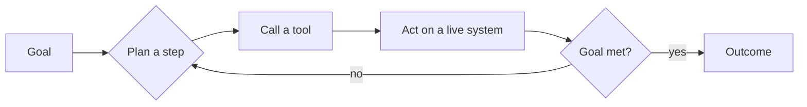

For most of the last decade, model risk management had a workable mental model of what it was governing. A model took an input, produced an output, and the job of validation was to interrogate the space in between: Is the methodology sound? Is the data representative? Are the outputs stable, explainable, and monitored for drift? The discipline of model risk management — model definition, independent validation, ongoing monitoring, effective challenge, principles now carried forward in [SR 26-2](https://www.federalreserve.gov/supervisionreg/srletters/SR2602.htm) — was designed around that shape. A model was, fundamentally, a function. You could bound it.

Agentic AI breaks the shape. An agent does not just return a prediction; it pursues a goal. It decides which tools to call, in what order, retries when something fails, and chains those steps into outcomes its designers never explicitly enumerated. The "output" is no longer a number you can backtest against a holdout sample — it is a sequence of *actions* in live systems: a query run, a record updated, an email sent, a ticket escalated, a payment queued. That is a different category of thing, and our control frameworks have not caught up to it.

## Where the existing controls quietly assume a function

The gap is easiest to see by walking through the core model-risk pillars and asking what each one silently assumed.

**Model definition.** The classic definition is a quantitative method that turns inputs into outputs. An agent is better described as a *policy* operating over an environment — it has memory, it has tools, and its behavior depends on state that didn't exist when validation was performed. The moment you can't fully enumerate the action space, the "model boundary" stops being a clean line and becomes a negotiation.

**Validation against a benchmark.** We validate by comparing model output to a known target on representative data. But an agent's trajectory is path-dependent and often non-deterministic. Two runs on the same prompt can diverge. The relevant question shifts from "is the answer accurate?" to "across the distribution of paths this agent might take, how often does it do something harmful, and how bad is the worst case?" Most validation shops are not yet instrumented to ask the second question.

**Effective challenge.** Independent challenge depends on a reviewer being able to reconstruct *why* a model produced a result. With a chain of tool calls, partial reasoning, and intermediate state, reconstruction is genuinely hard — and the agent's own explanation of its reasoning is not reliable evidence of the reasoning it actually used.

**Ongoing monitoring.** We monitor for drift in inputs and performance. Agents introduce failure modes that don't look like drift at all: a tool's API changes, a prompt injection redirects the goal, an upstream dependency degrades, or the agent finds a novel path that technically satisfies its objective while violating an intent nobody wrote down. These are *systems* failures, not model-performance failures, and they fall in the seams between teams.

The 2026 supervisory guidance (SR 26-2) pushes in the right direction by extending model-risk principles toward AI systems and lifecycle controls. But guidance sets expectations; it doesn't supply the validation machinery. The operational question — *what does effective challenge of an autonomous agent actually look like on a Tuesday* — is still mostly unanswered inside firms.

## The boundary problem is the real problem

Underneath all of this sits one structural issue: with agents, the line between "the model" and "the system around it" dissolves. The prompt, the tool definitions, the orchestration logic, the memory store, the permissions the agent runs with — each materially changes behavior, and most live *outside* what a model inventory traditionally captures. You can validate the language model in isolation and still have no meaningful assurance about the agent built on top of it, because the risk lives in the assembly, not the component.

That means the inventory question — *what do we even register as the thing under management?* — has to be answered before validation can mean anything. A firm that inventories "the LLM" and not "the agent, its tools, its permissions, and its operating context" is governing the wrong object.

## A more honest set of controls

The teams getting ahead of this are not waiting for perfect guidance. A few moves are doing real work:

- **Govern the agent as a system, not the model as a function.** Put the tools, permissions, and orchestration inside the model boundary — and inside the inventory.
- **Constrain the blast radius.** Scope credentials tightly, require human approval for irreversible or material actions, and make "what can this agent touch?" an explicit, reviewed control rather than an implementation detail.
- **Validate over distributions of behavior.** Adversarial and scenario testing — including prompt injection and goal-misgeneralization cases — matters more than point accuracy. Track worst-case, not just average-case.
- **Log trajectories, not just outputs.** Effective challenge and incident response both depend on being able to reconstruct what the agent did, step by step.
- **Treat autonomy as a risk tier.** An agent that drafts text for a human is not the same risk object as one that executes transactions. Controls should scale with how much the system can do without a person in the loop.

None of this requires throwing out SR 26-2. The principles — clear ownership, independent challenge, proportional controls, monitoring across the lifecycle — are the right principles. What's missing is the translation layer: the concrete validation methods, inventory definitions, and monitoring signals for systems that act rather than predict.

The capability curve isn't waiting for that translation to be finished. Agents are being deployed now, against frameworks written for a quieter kind of model. Closing that gap — deliberately, before an incident forces the issue — is the most useful thing model risk teams can be doing this year.

## Sources

- [Federal Reserve — SR 26-2: Revised Guidance on Model Risk Management (April 17, 2026)](https://www.federalreserve.gov/supervisionreg/srletters/SR2602.htm)
- [OWASP Top 10 for Agentic Applications (2026)](https://genai.owasp.org/resource/owasp-top-10-for-agentic-applications-for-2026/)
