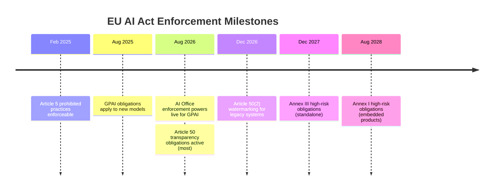

## What the Enforcement Switch Actually Flipped

August 2, 2026 did not introduce new rules — it turned existing rules into enforceable law. The gap between what GPAI providers were *required* to do since August 2025 and what they can now be *penalized* for not doing is the live risk.

This post builds directly on two earlier pieces — [the legislative close-out covered here](https://minwu-ai.github.io/council-vote-this-week-closes-the-legislative-loop-august-2-/) and the [Article 50 labelling compliance calendar covered here](https://minwu-ai.github.io/europe-s-ai-labelling-clock-is-ticking-what-the-final-conten/) — and focuses on what crossing that enforcement threshold means operationally.

GPAI providers have been subject to substantive obligations since 2 August 2025. What was missing until now was enforcement — the Commission's supervision and penalty powers were deliberately held back for a year so providers and the newly built AI Office could operationalise the regime before anyone faced sanctions.

What the AI Office can now do is concrete. It can send requests for information (RFIs) to verify compliance — and for simple RFIs, fines can be imposed if a provider's reply is incorrect or misleading. Beyond documentation, it can request access to the model through APIs or source code, and providers must comply or face fines. The fine ceiling most practitioners know but should not anchor to: prohibited AI practices carry penalties up to €35 million or 7% of worldwide annual turnover; other breaches, including GPAI model obligations, up to €15 million or 3%.

## Article 50: The Rule That Reaches Every Deployed Product

From 2 August 2026, Article 50 requires disclosure that someone is talking to an AI, that content is synthetic, that a system recognises emotions or categorises biometric data, and that images, audio, video or text are AI-generated.

The reach is wider than most enterprise governance teams have mapped: an organisation with no high-risk AI can still have obligations simply by operating a chatbot or publishing generated content. The editorial exemption is narrower than it sounds: simply having a human "check" AI-generated content is not sufficient — only genuine, substantive editorial oversight with clear accountability qualifies. One nuance from the Omnibus: watermarking obligations under Article 50(2) were postponed until December 2, 2026, but all other transparency obligations apply from August 2, 2026.

## The Omnibus Deferral Is Real — and Narrow

The Omnibus postpones high-risk obligations for Annex III AI systems from 2 August 2026 to 2 December 2027, and for Annex I embedded systems to 2 August 2028 — but it leaves the Article 50 transparency rules and the Article 4 AI literacy duty exactly where they were. This is the single most important thing to understand about the package: the delay is real and substantial for the heaviest compliance regime, but it is narrow. The classification obligation did not move with the deadline; only the date on which non-compliance starts to bite has moved, not the requirements themselves.

## The GDPR Parallel — and Where It Breaks Down

The precedent most governance teams reach for is GDPR: a landmark law with a long ramp-up followed by selective, high-profile early enforcement that shaped compliance norms for years. The parallel is instructive but imperfect. GDPR enforcement was fragmented across 27 national DPAs with very different philosophies. The AI Act concentrates GPAI oversight in a single body — a clarity advantage, but also a resource constraint. The AI Office currently has 145 staff across six teams, with its regulation and compliance team numbering 34. A Pour Demain report found this inadequate, recommending scaling to at least 160 supervisory staff by 2030.

> **My read:** The AI Office's preferred opening move will be the compliance dialogue, not the fine — it described "technical compliance dialogues" as its preferred initial tool. But where those dialogues do not resolve concerns, formal powers follow. The GDPR lesson is that early enforcement concentrated on a small number of visible, egregious cases chosen partly for signalling value. Expect the same pattern here.

## The Supply-Chain Liability Organisations Are Missing

The compliance surface extends well beyond frontier model labs. If your product is built on, hosts or fine-tunes a general-purpose model, this is a supply-chain question, not just a headline about model makers.
