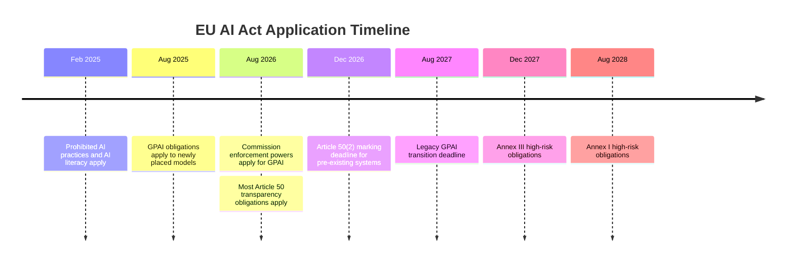

## Two Different Milestones Happened on August 2

Much of the discussion around August 2, 2026 has focused on a single headline: **the EU AI Act became enforceable**.

That is directionally correct—but legally incomplete.

Two different regulatory milestones arrived on the same day:

- **For general-purpose AI (GPAI) models**, the European Commission's enforcement powers entered into application. Providers have been subject to substantive obligations since 2 August 2025; what changed is that the AI Office can now investigate, request information, require corrective measures, and impose administrative fines.
- **For AI systems**, most of **Article 50's transparency obligations** began applying, extending compliance requirements well beyond frontier model developers to many organisations deploying public-facing AI systems.

These are separate parts of the AI Act, aimed at different actors, enforced through different mechanisms, but together they significantly expand the Act's practical reach.

This post builds directly on two earlier pieces—the [legislative close-out](https://minwu-ai.github.io/council-vote-this-week-closes-the-legislative-loop-august-2-/) and the [Article 50 implementation timeline](https://minwu-ai.github.io/europe-s-ai-labelling-clock-is-ticking-what-the-final-conten/)—and focuses on what crossing this regulatory threshold means operationally.

---

## GPAI Enforcement Has Now Become Real

For providers of general-purpose AI models, the substantive obligations did **not** begin on August 2, 2026.

Those obligations have applied to GPAI models placed on the market since **2 August 2025**, including requirements around technical documentation, copyright policy, transparency, and—for models posing systemic risk—additional risk management and evaluation obligations.

The one-year gap was intentional. It gave providers time to implement compliance programmes while allowing the newly established AI Office to build supervisory capability before formal enforcement began.

That transition period has now ended.

The AI Office can now:

- issue requests for information (RFIs);
- require documentation supporting compliance;
- request access to GPAI models for evaluation;
- order corrective measures where necessary; and
- impose administrative fines for non-compliance.

The penalty ceilings are substantial:

- **up to €35 million or 7% of worldwide annual turnover** for prohibited AI practices;
- **up to €15 million or 3%** for many other violations, including GPAI obligations.

For organisations building or supplying frontier models, any gap between documented compliance and actual practice has become an immediate regulatory risk.

---

## The AI Act Has Three Different Regulatory Layers

One reason the August 2 milestone is widely misunderstood is that the AI Act regulates three different things.

| Layer | Primary Target | Examples |
|--------|----------------|----------|
| **General-purpose AI (Chapter V)** | Foundation model providers | OpenAI, Anthropic, Google, xAI, Mistral |
| **High-risk AI (Title III)** | AI systems used in regulated applications | Hiring, medical devices, credit scoring, law enforcement |
| **Article 50 Transparency** | Public-facing interactions with AI systems | Chatbots, deepfakes, emotion recognition, AI-generated public-interest content |

Most public discussion focuses on the first two layers because they impose the most extensive governance and technical requirements.

Article 50 is different.

It does **not** primarily regulate frontier models or high-risk AI systems. Instead, it regulates **how people are informed when they interact with AI or consume certain categories of AI-generated content**.

That distinction explains why organisations that never build a frontier model—and never deploy a high-risk AI system—may still have obligations under the AI Act.

---

## Article 50 Reaches Far Beyond High-Risk AI

While the AI Office's new enforcement powers mainly concern GPAI providers, August 2 also activated a different part of the Act that reaches far more organisations: **Article 50's transparency regime**.

Unlike the GPAI rules, Article 50 is not aimed at model developers.

Instead, it creates transparency obligations for providers and deployers of certain AI systems, including:

- informing users when they are interacting with AI (unless this is obvious);
- disclosing the use of emotion-recognition or biometric categorisation systems;
- clearly labelling AI-generated or AI-manipulated deepfakes; and
- disclosing certain AI-generated text published on matters of public interest unless meaningful human review or editorial responsibility exists.

The practical implication is easy to overlook.

An organisation may have **no high-risk AI systems**, **no foundation models**, and **no AI research capability**, yet still incur obligations simply by deploying customer-facing AI assistants or publishing AI-generated content covered by Article 50.

One important nuance from the Digital Omnibus should also be noted.

The machine-readable marking requirement under Article 50(2) received a limited transition period for systems already placed on the market before 2 August 2026, delaying that specific obligation until **2 December 2026**. The remaining transparency obligations continue to apply from **2 August 2026**.

---

## The Omnibus Deferral Is Real — But Narrow

The Digital Omnibus substantially postpones the application of the AI Act's high-risk regime:

- **Annex III standalone high-risk AI systems:** 2 December 2027
- **Annex I embedded products:** 2 August 2028

Those postponements are significant.

However, they do **not** affect:

- GPAI enforcement;
- Article 50 transparency obligations; or
- Article 4's AI literacy requirement.

The practical lesson is that although the heaviest conformity-assessment regime has been delayed, organisations should not conclude that AI Act compliance itself has been postponed.

For many enterprises, obligations are already live.

---

## The GDPR Parallel—and Where It Breaks Down

The comparison many governance teams instinctively make is GDPR.

The parallel is useful.

Both regimes provided a lengthy implementation period before meaningful enforcement, and both rely heavily on documentation, organisational governance, and regulatory supervision.

But the comparison also has limits.

GDPR enforcement is distributed across 27 national data protection authorities with different priorities and enforcement philosophies.

For GPAI models, the AI Act centralises supervision within the European Commission's AI Office.

That creates greater consistency, but also concentrates enforcement capacity in a relatively small organisation.

The AI Office has indicated that **technical compliance dialogue** will generally be its preferred initial supervisory approach before moving toward formal enforcement where necessary.

> **My read:** Early enforcement is likely to resemble GDPR's first years—not through hundreds of immediate penalties, but through a relatively small number of strategically selected investigations designed to establish expectations for the entire market.

---

## The Governance Shift Is Bigger Than It First Appears

The most important consequence of August 2 is not simply that fines became available.

It is that the AI Act now operates across multiple layers of the AI value chain.

Frontier model providers now face active Commission supervision over GPAI obligations.

At the same time, many downstream organisations deploying AI systems have entered Article 50's transparency regime—even if they never develop their own models or operate high-risk AI.

That changes the governance conversation.

AI compliance is no longer solely a question for frontier laboratories or regulated high-risk sectors.

It has become an operational responsibility that increasingly follows AI wherever it is deployed.
