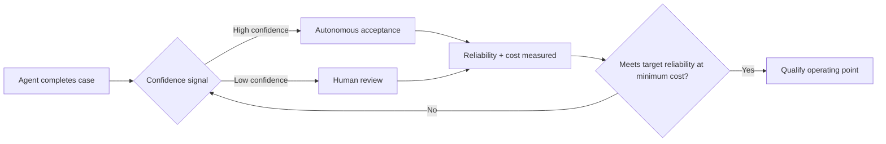

# 📊 The number that doesn't show up on any leaderboard

Two weeks ago, this site [covered Scale AI's READY framework](https://minwu-ai.github.io/ready-or-not-scale-ai-s-new-benchmark-puts-a-price-tag-on-ag/) — Reliable Enterprise Agent Deployment — and its headline finding: two enterprise agents nearly tied on accuracy can require wildly different amounts of human oversight to hit the same reliability bar.

That piece focused on the size of the gap. This one is about why it exists.

Two agentic systems score 72.8% and 72.5% accuracy on the same clinical-audit benchmark — a gap so small it would round to a tie on most vendor comparison sheets.

Yet under the paper's evaluated oversight policy, and assuming human review successfully resolves 90% of escalated cases, one system requires 39.2% of cases routed to human review while the other requires only 29.6% to statistically qualify at the same 76% reliability target.

That's a nearly 10-percentage-point difference in human-review burden between systems that look almost identical on accuracy.

That gap, buried inside a September 2026 arXiv preprint from researchers at Scale AI, UC Santa Cruz, and Vanderbilt University Medical Center, is the empirical center of READY.

The framing is deceptively simple but genuinely changes the buyer's question. Existing benchmarks primarily ask whether an agent can complete realistic professional work. Enterprise deployment asks something downstream: can the agent meet a required reliability level under an acceptable oversight policy and at tolerable operating cost?

READY doesn't replace accuracy scores.

It asks what happens after the benchmark.

# ⚙️ How READY actually works

Given an agent, a workflow, and candidate oversight policies, READY measures the reliability and operating cost of the combined human-AI system, selects a minimum-cost policy that satisfies a specified reliability target, and statistically qualifies that operating point on held-out cases.

In the paper's clinical case study, the routing signal is the agent's own stated confidence.

High-confidence cases can be accepted autonomously. Lower-confidence cases are escalated to human review. READY then searches across possible confidence thresholds to identify an operating point that satisfies the required reliability level with the lowest modeled cost.

The framework itself is broader than this implementation: READY does not require self-reported confidence, and other routing signals or oversight policies could be substituted.

The clinical experiment also makes an important modeling assumption: human review is assumed to successfully resolve 90% of escalated cases. The reported qualification results — including the 39.2% versus 29.6% example — are therefore conditional on that assumption rather than measurements of an actual staffed production workflow.

That distinction matters. READY is a framework for estimating and qualifying deployment policies, not a prediction of exactly how many reviewers a company will need.

# 🏥 It starts from a benchmark that already distrusts the headline score

The empirical testbed is CliniCARE-Bench, a retrospective clinical-audit benchmark built from 25 clinician-authored scenarios instantiated into 750 patient-specific cases using MIMIC-IV data, evaluated across 16 agentic systems.

That underlying benchmark is worth pausing on independently.

CliniCARE-Bench found that defect-free accuracy — crediting a verdict only when it is correct and the investigation avoids prohibited shortcuts or process violations — runs 4.8 to 14.8 percentage points below raw accuracy and can reorder the leaderboard.

READY therefore builds its oversight-cost analysis on top of an evaluation layer that already asks whether the agent earned its answer properly.

The progression is important:

Raw accuracy asks whether the answer was right.

Defect-free accuracy asks whether the agent got there acceptably.

READY asks what it costs to operate that agent at a required reliability level.

Those are three different questions.

# 🎯 The more important result: accuracy and self-knowledge aren't the same capability

The 10-point review gap is striking, but the deeper result may be the reason it exists.

Across the 16 evaluated systems, autonomous accuracy and the quality of the confidence signal used for routing were essentially uncorrelated — Scale reports a Pearson correlation of −0.12.

In other words, being better at the task does not necessarily mean being better at identifying the cases where you are likely to fail.

That creates two economically distinct capabilities:

1. Can the agent do the work correctly?
2. Can the system identify which cases should not be trusted autonomously?

Traditional leaderboards mostly measure the first.

READY makes the second economically visible.

A slightly less accurate agent with a strong routing signal can potentially identify its difficult cases and selectively send them to humans. A nominally stronger agent with poor confidence calibration may force humans to review far more cases to reach the same reliability target.

That is how two systems separated by only 0.3 accuracy points can produce materially different oversight burdens.

And that is why the framework matters for procurement.

# 🔍 Why this complements, not duplicates, the trace-level critique

Readers of [this site's earlier piece on agent benchmark log analysis](https://minwu-ai.github.io/agent-benchmark-scores-are-lying-to-you-and-log-analysis-is-/) will recognize the family resemblance.

Both arguments start from the same problem: outcome-only scores hide deployment-relevant information.

But they attack different layers.

The log-analysis critique is fundamentally about validity: does the recorded benchmark score accurately describe what the agent actually did during execution?

READY assumes you already have meaningful performance evidence and asks a downstream operational economics question:

Given that this agent performs at this level, how much intervention is required to operate it at the reliability level we actually need?

A vendor could pass every trace-level audit and still be the more expensive system to operate.

Conversely, an agent that sits slightly lower on a conventional leaderboard could become the more attractive deployment candidate if its failures are easier to identify and selectively escalate.

The evaluation stack is therefore getting deeper:

Outcome → execution trace → failure detectability → oversight burden → deployment economics.

READY's contribution is pushing evaluation further down that stack.

# ⚠️ What READY still doesn't solve

An independent critique of the underlying CliniCARE-Bench results points to a limitation that READY does not itself eliminate.

Clinical Trial Vanguard argued that a system that scores well while bypassing longitudinal-record review could gain deployment confidence faster than one that scores lower but documents its reasoning at every decision node.

The broader point is useful: surfacing a problem and governing it are different things.

READY can measure whether a routing signal successfully separates safer cases from riskier ones, but it cannot make a weak routing signal informative.

In this case study, routing depends on the agents' own stated confidence — and the results themselves show that the quality of that confidence signal varies substantially across systems. Selective review becomes much less effective when the routing signal is poor.

Nor should a READY result be treated as a permanent property of a model.

The deployment profile belongs to a particular combination of agent, workflow, oversight policy, reliability target, cost assumptions, and data distribution. Change the workflow, reviewer effectiveness, routing mechanism, or underlying model and the operating point may change with it.

That is a limitation — but also arguably the point.

# 💡 The procurement question is changing

Enterprise AI procurement has spent much of the last few years asking:

Which model performs best?

Agentic deployment increasingly requires a different sequence of questions:

How often is it right?

Can we identify when it is likely to be wrong?

How much human intervention is required to reach our reliability threshold?

What does that intervention cost?

READY's contribution is not proving that one agent is universally better than another. It is giving buyers a framework for turning benchmark performance into an operating policy.

That distinction matters because the cheapest model API is not necessarily the cheapest agent to deploy, and the highest-scoring agent is not necessarily the one requiring the least human oversight.

A leaderboard tells you how an agent performed on a test.

An oversight-cost curve begins to tell you what living with that agent might cost.
