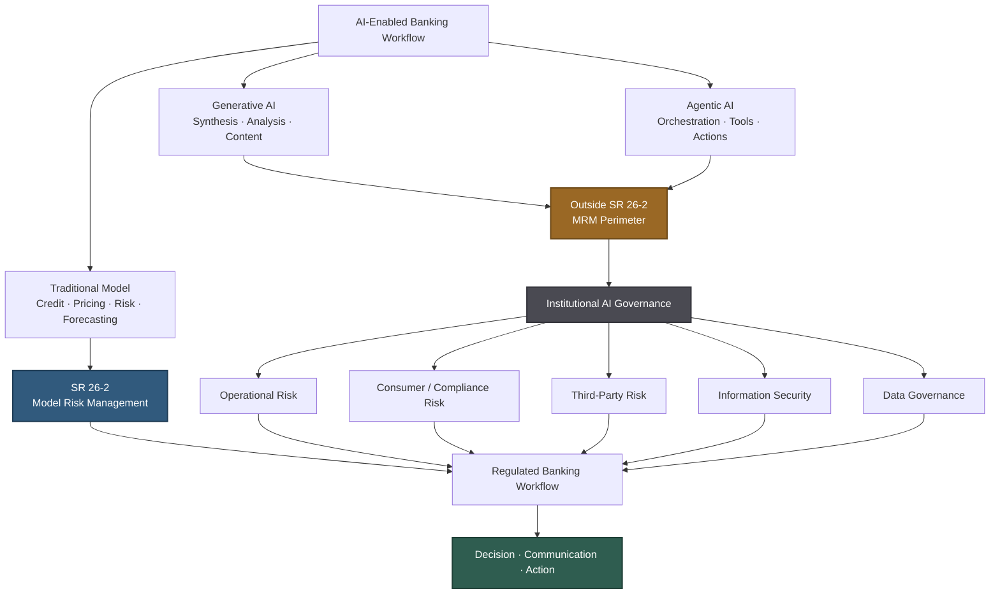

## ⚖️ The Carve-Out Is a Transfer, Not an Exemption

The most consequential sentence in [SR 26-2](https://www.federalreserve.gov/supervisionreg/srletters/SR2602.htm) is buried in a footnote:

> "Generative AI and agentic AI models are novel and rapidly evolving. As such, they are not within the scope of this guidance."

That sentence appears in the April 17, 2026 joint model risk management guidance issued by the Federal Reserve, OCC, and FDIC — the first major overhaul of U.S. bank model risk management guidance in fifteen years.

But the footnote does **not** say that generative or agentic AI requires no governance. It points institutions back toward their own risk-management and governance practices to determine appropriate controls for systems outside the guidance.

That distinction matters.

**SR 26-2 creates a scope gap, not a regulatory vacuum.**

A GenAI system can sit outside SR 26-2's formal model risk management perimeter while still being subject to enterprise risk management, operational risk, third-party risk, information security, consumer compliance, fair-lending requirements, records and communications controls, and the regulatory obligations governing whatever business process the AI touches.

The unresolved problem is therefore not whether banks must govern GenAI. They must.

The problem is **how**.

SR 26-2 provides no GenAI-specific MRM supervisory template for connecting those existing obligations into a coherent governance architecture. Banks must determine where AI systems enter regulated workflows, what decisions or evidence they influence, which existing control functions own the resulting risks, and what documentation is sufficient to demonstrate effective oversight.

### The Emerging AI Governance Boundary

*The key distinction is scope versus obligation. SR 26-2 provides a defined model-risk-management perimeter for traditional models, while generative and agentic AI explicitly sit outside that perimeter. Outside SR 26-2, however, does not mean outside governance: those systems remain subject to institutional risk frameworks and to the regulatory obligations attached to the banking workflows they influence.*

This becomes particularly difficult with agentic systems.

Suppose an AI agent gathers customer information, interprets policy, invokes a traditional credit model, summarizes the result, and drafts a customer communication. The credit model may remain squarely inside SR 26-2. The agent orchestrating the workflow sits outside the guidance's formal MRM perimeter.

The result is a layered accountability problem:

> **The governed model may sit inside an AI-mediated workflow whose orchestration, interpretation, and downstream actions require a different governance architecture.**

In other words, the regulatory boundary can now run **through the middle of a single automated workflow**, rather than neatly around the technology stack.

That boundary problem may prove more important than the carve-out itself.

## 🔬 What the Citigroup-Affiliated Preprint Actually Proposes

A July 2026 preprint by [Mao, Lin, Kang, and Wang (arXiv:2607.04103)](https://arxiv.org/abs/2607.04103) offers a timely practitioner-oriented response to precisely this problem. The authors are affiliated with Citigroup and Florida State University.

*The paper is a preprint and has not yet been peer-reviewed; it should be treated as a practitioner working paper rather than regulatory guidance.*

The authors propose what they call the **Generative AI Control Framework (GAICF)**: an SR 26-2-compatible governance framework for GenAI-enabled financial workflows that may operate outside the traditional model boundary.

Its starting observation is important.

Generative AI does not need to calculate a credit score or make an underwriting decision directly to create material regulatory risk. It can affect the surrounding decision environment by summarizing monitoring results, interpreting policies, assisting analysis, generating validation documentation, drafting adverse-action language, or explaining model outputs.

In other words, the risk may arise not from replacing the regulated model, but from **changing how the model's output is interpreted, documented, communicated, or acted upon**.

The paper organizes GenAI uses around five capability patterns:

1. **Knowledge synthesis**
2. **Content generation**
3. **Analytical assistance**
4. **Interaction**
5. **Workflow orchestration**

Those capabilities are then mapped into financial workflows and associated control requirements.

The resulting governance logic is subtly different from traditional MRM:

> **Risk should be calibrated partly according to what a GenAI output can do to a regulated decision or workflow — not simply according to whether the underlying AI system satisfies the formal definition of a model.**

That is arguably GAICF's most useful contribution.

SR 26-2 defines a regulatory boundary. GAICF attempts to provide a control architecture for AI capabilities operating immediately outside that boundary.

## 🧭 Why Workflow Consequence Matters More Than the Model Label

Traditional model governance begins with classification:

> Is this system a model?

For GenAI, that question remains relevant, but it may no longer be sufficient.

Consider three uses of the same foundation model:

- summarizing an internal meeting;
- interpreting a lending policy for an underwriter;
- drafting an adverse-action explanation sent to a customer.

Technically, all three could use the same underlying model.

Their governance significance is radically different.

The first primarily creates productivity and information-management risk. The second can influence a regulated decision. The third can directly affect a regulated customer communication.

The underlying technology has not changed.

**The consequence of the output has.**

This is why workflow mapping is particularly useful for GenAI governance. Instead of attempting to classify risk solely from model architecture, size, provider, or technical capability, the institution asks:

**Where does the output go next?**

Does a human merely read it?

Does it become evidence supporting a decision?

Does another system consume it?

Does it modify a customer record?

Does it trigger an action?

Does it generate language that becomes part of a regulated communication?

For agentic AI, these questions become even more important because the distinction between *output* and *action* begins to disappear.

An LLM-generated paragraph is one thing.

An agent interpreting that paragraph and invoking another system is another.

## 📏 The Control Gap Is Already Visible

The governance problem is not merely theoretical.

The [Wolters Kluwer US Banking AI Risk and Governance Index](https://www.wolterskluwer.com/en/news/wolters-kluwer-survey-highlights-ai-governance-and-other-ongoing-needs-for-banking-institutions), released May 28, 2026, surveyed 230 U.S. banking professionals about AI governance preparedness.

Two operational control weaknesses stood out.

Approximately **38%** identified regulatory reporting of AI failures as the area for which their institutions were least prepared, while approximately **34%** selected model kill-switch protocols.

Together, roughly **72%** of respondents selected one of those two areas.

These are not exotic frontier-AI problems.

They are basic operational questions:

**How do we stop the system when something goes wrong?**

And:

**How do we identify, document, escalate, and report what happened?**

Those questions become particularly difficult when the AI component itself sits outside traditional MRM but interacts with models, systems, and business processes that remain heavily regulated.

This is where traceability, workflow mapping, human review, escalation procedures, and evidence retention become central governance controls rather than merely technical best practices.

## 🧩 Where the Frameworks Agree — and Where They Differ

There is broad agreement among practitioners that SR 26-2's carve-out should not be interpreted as a governance holiday.

The more difficult question is what architecture banks should use instead.

General-purpose frameworks such as the [NIST AI Risk Management Framework](https://www.nist.gov/itl/ai-risk-management-framework) and [ISO/IEC 42001](https://www.iso.org/standard/81230.html) provide useful foundations. NIST organizes AI risk management around Govern, Map, Measure, and Manage, while ISO/IEC 42001 establishes an organizational AI management system.

GAICF approaches the problem from a different direction.

| Approach | Primary Anchor | Relative Strength |
|---|---|---|
| NIST AI RMF | Govern, Map, Measure, Manage | Broad AI-risk taxonomy; technology- and industry-agnostic |
| ISO/IEC 42001 | AI management system | Strong organizational and process structure |
| GAICF / workflow mapping | Financial workflows and regulated-decision touchpoints | More directly tied to financial use cases and downstream consequences |

These approaches are not mutually exclusive.

A bank could use NIST AI RMF as its enterprise AI risk taxonomy, ISO/IEC 42001 concepts to structure the management system, and workflow-level control mapping to translate those principles into evidence for particular financial processes.

The interesting contribution of GAICF is therefore not that it replaces these frameworks.

It addresses a different layer of the problem:

> **How do abstract AI governance principles become controls around a specific regulated workflow?**

That question is especially important in banking because supervisory scrutiny ultimately tends to become concrete.

What system was used?

For what purpose?

What information entered it?

What output did it produce?

Who reviewed that output?

What downstream decision did it influence?

What evidence was retained?

And what happens when it fails?

Workflow-oriented governance provides a natural way to answer those questions.

## 🤖 Agentic AI Makes the Boundary Problem Harder

Generative AI already complicates traditional model classification.

Agentic AI goes further because it can turn probabilistic outputs into operational actions.

A conventional GenAI assistant may produce a recommendation for a human.

An agent may instead retrieve information, choose a tool, invoke another model, update a system, generate a communication, and initiate the next step in a workflow.

That means governance increasingly has to observe not only **what the AI says**, but also **what the AI does**.

This connects directly to a broader pattern I have discussed previously: [agentic AI has already outrun the traditional governance playbook](https://minwu-ai.github.io/agentic-ai-and-the-governance-gap/).

SR 26-2 makes that problem unusually visible in banking, because the line it draws no longer sits neatly around the technology stack.

A governed traditional model can become one tool inside a larger agentic system that itself sits outside SR 26-2.

The institution therefore needs controls not only around model performance, but around:

- orchestration and tool permissions;
- human approval points;
- data and system access;
- execution traceability;
- downstream actions;
- override and escalation mechanisms;
- kill-switch capability;
- incident reconstruction.

Traditional MRM remains necessary.

It is simply no longer sufficient to describe the whole system.

## 🔭 What to Watch

The most important question is not whether regulators eventually issue GenAI-specific guidance. They may.

The immediate question is what banks do before that happens.

GAICF's workflow-output framing offers one plausible direction. Its strength is that it forces governance teams to connect AI capability to actual business consequences rather than debating endlessly whether a particular implementation technically qualifies as a "model."

Its limitations are equally important.

The framework remains a preprint, is not regulatory guidance, and its five capability patterns operate at a relatively high level. Individual institutions will still need to translate them into risk tiers, control ownership, testing standards, approval authorities, monitoring thresholds, incident procedures, and examination evidence appropriate to their own businesses.

The Wolters Kluwer survey also suggests where this problem may become particularly consequential. Respondents identified **lending and underwriting (33%)** and **collections and recovery (30%)** as the functions where agentic AI presents the greatest risk without sufficient human-in-the-loop controls.

These are workflows where AI failures can intersect directly with consequential consumer and compliance outcomes.

And that leads to the larger lesson of SR 26-2.

The agencies did not forget generative AI.

They explicitly chose not to place rapidly evolving generative and agentic systems inside the revised MRM framework.

That choice creates a boundary.

> **SR 26-2 governs what is inside the model-risk perimeter. Banks must now determine how to govern AI systems operating around it — particularly when those systems can influence, interpret, communicate, or act upon the outputs of models that remain firmly inside.**

The governance gap is therefore not an absence of regulation.

It is an absence of **connective tissue** between traditional model risk management and the emerging AI systems increasingly surrounding regulated decisions.

For banks deploying GenAI and agentic AI today, building that connective tissue cannot wait for the next supervisory letter.
