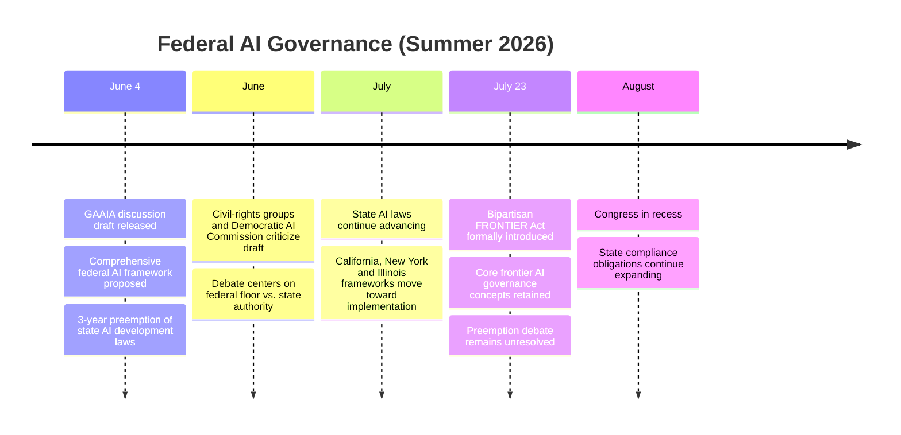

# ⚖️ The Preemption Trap: How the FRONTIER Act Inherited GAAIA's Hardest Political Problem

When Representatives Jay Obernolte (R-CA) and Lori Trahan (D-MA) released the [**Great American Artificial Intelligence Act (GAAIA)**](https://trahan.house.gov/uploadedfiles/gaaia_discussion_draft_section-by-section.pdf) discussion draft on June 4, 2026, the proposal immediately attracted attention—not because it attempted to regulate frontier AI, but because it attempted something even more ambitious: temporarily **preempt state regulation of AI development** while constructing a comprehensive federal framework.

That proposal never advanced in its original form.

Yet that is not where the story ended.

Less than two months later, on **July 23, 2026**, the same bipartisan sponsors introduced 
the [**FRONTIER Act (Frontier Risk Oversight, National Transparency, Independent Evaluation, and Reporting Act)**](https://obernolte.house.gov/sites/evo-subsites/obernolte.house.gov/files/evo-media-document/26-07-21-frontier-act-section-by-section.pdf), 
explicitly describing it as legislation developed from the broader GAAIA framework. The federal effort survived—but so did the debate that nearly defined the original draft: **how much state authority should Congress replace?**

Ironically, the longer Congress debates that question, the more sophisticated state AI governance becomes.

---

## 🏛️ From GAAIA to the FRONTIER Act

The evolution of the legislation tells the story better than any headline.

The important point is that **GAAIA did not simply fail**.

Instead, Congress narrowed and repackaged the proposal into legislation focused specifically on frontier AI. The discussion draft became a formal bill—but the most politically difficult element, federal preemption of state AI law, remained.

---

## ⚖️ Why Preemption Became the Central Political Question

The June discussion draft proposed an unusual compromise.

Instead of broadly overriding all AI regulation, it would have temporarily preempted **state regulation of AI development** while largely preserving state authority over **how AI systems are deployed and used**.

That distinction mattered.

Supporters argued that frontier model developers should not face fifty different development standards.

Critics argued that states should not surrender authority until Congress demonstrated that the federal framework provided protections at least as strong as the ones states were already building.

The Democratic House AI Commission—led by Representatives Ted Lieu, Valerie Foushee, and Josh Gottheimer—summarized its concern succinctly, stating that the discussion draft **"does not meet the enormity of the moment."** Representative Lieu further argued that the proposal failed to satisfy many of the priorities raised by civil-rights organizations, labor groups, and public-interest advocates.

Legal scholars reached a similar conclusion from a different direction.

As **Lawfare** observed:

> *"GAAIA is the best federal frontier AI safety framework yet proposed, but its sweeping preemption of state AI laws makes it net-negative as written."*

That critique remains relevant even after introduction of the FRONTIER Act.

The debate is no longer whether the federal government should regulate frontier AI.

It is whether federal regulation should replace state regulation that is already becoming operational.

---

## 📏 Meanwhile, State AI Governance Kept Moving

While Congress continued debating structure, state legislatures continued producing enforceable obligations.

| Framework | Jurisdiction | Status | Primary Focus |
|------------|-------------|---------|---------------|
| [**SB 53 (TFAIA)**](https://leginfo.legislature.ca.gov/faces/billTextClient.xhtml?bill_id=202520260SB53) | California | Effective Jan. 1, 2026 | Frontier safety frameworks, incident reporting, whistleblower protections |
| [**RAISE Act**](https://www.nysenate.gov/legislation/bills/2025/S6953/amendment/B) | New York | Signed Dec. 2025 | Frontier model governance, safety frameworks, incident reporting |
| [**SB 315 (AISMA)**](https://www.ilga.gov/Legislation/BillStatus?DocNum=315&GAID=18&DocTypeID=SB&LegId=157797&SessionID=114) | Illinois | Effective Jan. 1, 2027 | Independent annual third-party compliance audits |
| [**SB 26-189**](https://leg.colorado.gov/bills/sb26-189) | Colorado | Effective Jan. 1, 2027 | High-impact ADMT transparency, consumer notice and explanation rights |

These laws are not identical.

California and New York primarily require frontier developers to establish governance frameworks and disclose serious incidents.

Illinois goes one step further by requiring **independent third-party audits**, shifting oversight beyond developer self-attestation.

Colorado follows a different path, focusing primarily on **high-impact automated decision systems (ADMTs)** used in consequential decisions rather than frontier foundation models themselves.

Rather than converging on one identical regulatory model, states are experimenting with complementary approaches.

That diversity makes future federal preemption increasingly difficult.

---

## 🔐 The Real Compliance Challenge Isn't Regulatory Fragmentation

Many discussions describe today's environment simply as a "patchwork."

That is only partially accurate.

The larger issue is timing.

If Congress had enacted a comprehensive federal framework before states legislated independently, preemption would have been politically easier.

Instead, several states have already enacted operational governance systems.

Compliance teams are beginning to implement those requirements today.

Every month that implementation continues increases switching costs—for regulators, developers, and enterprises alike.

Federal preemption therefore becomes progressively more expensive, not merely politically but operationally.

The debate is gradually shifting from:

> **"Should states regulate AI?"**

to

> **"Should Congress replace regulatory systems that organizations have already built?"**

Those are very different policy questions.

---

## 📚 Illinois Shows Why the Political Cost Keeps Rising

Illinois's [**AI Safety Measures Act (SB 315)**](https://www.ilga.gov/Legislation/BillStatus?DocNum=315&GAID=18&DocTypeID=SB&LegId=157797&SessionID=114) illustrates the problem particularly well.

As discussed in my earlier post on **Illinois SB 315**, annual independent third-party audits fundamentally change the governance model.

Safety frameworks are no longer merely documents produced by developers.

They become commitments that must withstand external review.

Once organizations begin investing in those governance processes, federal legislation that attempts to replace them becomes significantly more disruptive.

Ironically, congressional delay makes national standardization harder rather than easier.

---

## 🔍 Looking Ahead

The FRONTIER Act demonstrates that bipartisan interest in federal AI governance remains alive.

The difficult question is no longer whether Congress can write a federal framework.

It is whether Congress can establish one that is strong enough to justify limiting state authority while accommodating governance systems that states have already begun implementing.

That is the preemption trap.

Every month Congress waits, state AI governance becomes more mature.

And every state law that moves from statute to operational compliance raises the political and practical cost of replacing it.
