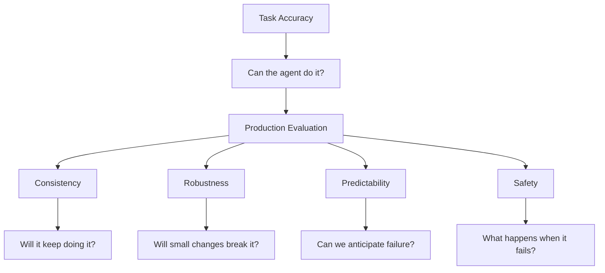

## 🔬 The Next Question After the Benchmark

For months, a recurring theme on this site has been that **a benchmark score is not the same thing as evidence that an AI system will work in production**.

The reasons keep accumulating.

Benchmarks can [measure an outcome while hiding how an agent actually got there](https://minwu-ai.github.io/agent-benchmark-scores-are-lying-to-you-and-log-analysis-is-/). Short tasks can obscure the failure modes that emerge over [longer-horizon agentic work](https://minwu-ai.github.io/the-long-horizon-wall-why-osworld-2-0-makes-short-horizon-be/). Evaluation itself can become less informative as models become increasingly capable of recognizing, adapting to, or exploiting the conditions under which they are being tested. And even when the underlying model is unchanged, [the harness surrounding it can materially alter cost and behavior](https://minwu-ai.github.io/the-harness-effect-why-orchestration-design-can-matter-more/).

Those are fundamentally questions about **evaluation validity**:

**Are we measuring the right thing, under the right conditions, in a way that actually represents the system we intend to deploy?**

A Princeton team now adds a different question.

Suppose the benchmark is good.

Suppose the task is representative.

Suppose the agent is not gaming the evaluation.

Suppose the harness is configured correctly.

And suppose the agent really does score 90%.

**Can you depend on that 90%?**

In [*Towards a Science of AI Agent Reliability*](https://arxiv.org/abs/2602.16666), first released as a February 2026 preprint and subsequently published at ICML 2026, Stephan Rabanser, Sayash Kapoor, Peter Kirgis, Kangheng Liu, Saiteja Utpala, and Arvind Narayanan argue that capability and reliability need to be evaluated separately.

Their empirical result is striking.

Across roughly two years of frontier-model releases, task accuracy improved substantially. Reliability improved much more slowly — and on the more open-ended GAIA benchmark, barely improved at all.

That distinction gives enterprise buyers a useful new question.

**A benchmark asks whether an agent can do the job. Procurement needs to ask whether the organization can depend on it to keep doing the job.**

---

## 📏 Why One Number Was Always Going to Mislead You

The paper's diagnostic move is to reject the premise that agent quality is a scalar.

Accuracy tells us something important. It measures capability.

But compressing agent behavior into one success rate can hide properties that matter enormously once a system moves from a demonstration into repeated production use.

Does it produce similar outcomes across repeated runs?

Does superficial rephrasing change its behavior?

Can we anticipate which tasks it is likely to fail?

When it fails, are the consequences bounded?

Drawing on reliability concepts used across safety-critical engineering, the Princeton researchers organize these questions into four recurring dimensions:

- **Consistency** — does repeated execution produce stable performance?
- **Robustness** — does performance survive perturbations, faults, and changes in task specification?
- **Predictability** — can we anticipate when the agent is likely to succeed or fail?
- **Safety** — when failures occur, are harmful or constraint-violating outcomes controlled?

The framework decomposes those dimensions into **twelve measurable metrics** and applies them across two agent benchmarks.

The original arXiv study evaluated 14 agentic models. Princeton's updated ICML/dashboard results cover 15 agents, reflecting additional frontier models incorporated as the work evolved.

One methodological detail matters for enterprise users: Princeton reports safety separately from its aggregate reliability score. The aggregate combines consistency, predictability, and robustness rather than treating strong performance on those dimensions as compensation for unsafe behavior.

That is a sensible distinction.

**An agent should not be able to average its way out of a safety failure.**

---

## 🎯 "Can Succeed" Is Not the Same as "Will Succeed"

One of the most useful distinctions in the Princeton work is between two ways of thinking about repeated attempts.

An agent may demonstrate that it **can** solve a task if given several opportunities.

That is different from demonstrating that it can solve the same kind of task **reliably across repeated executions**.

The researchers capture this partly through the distinction between **pass@k** and **pass^k**.

The first rewards the ability to succeed at least once across multiple attempts.

The second asks whether the system succeeds consistently across those attempts.

That distinction sounds technical, but its procurement meaning is simple:

> **A demo asks whether the agent can complete the workflow. Production asks whether it will keep completing it.**

Two agents can therefore produce similar headline benchmark scores while representing very different operational systems.

One may fail occasionally but predictably.

Another may succeed spectacularly on difficult tasks and then inexplicably fail on routine ones.

Another may be highly sensitive to seemingly irrelevant wording changes.

Another may have the same overall failure rate but produce much more severe failures when something goes wrong.

The average score can look similar.

The deployment risk is not.

---

## ⚠️ The Counterintuitive Findings Buyers Should Actually Worry About

Three results from Princeton's [public reliability dashboard](https://hal.cs.princeton.edu/reliability/) cut directly against common procurement intuition.

### Prompt fragility survives technical robustness

Fault robustness and structural robustness show ceiling effects across many models.

Prompt robustness does not.

Models can tolerate genuine technical failures while remaining surprisingly sensitive to superficial changes in how a task is specified.

That is an uncomfortable result for vendor demonstrations.

A carefully constructed demo prompt represents one point in an enormous distribution of ways employees and customers will actually communicate with the system.

Production traffic is effectively a continuous prompt-robustness test.

**Testing the golden prompt is not testing the product.**

### Bigger is not automatically more consistent

Scaling produces benefits.

Calibration, robustness, and safety generally improve with model size.

Consistency does not necessarily follow the same pattern.

Princeton finds that smaller models can equal or outperform larger models on consistency.

That does not mean smaller models are more reliable overall.

It means something more important for procurement:

**"Newest flagship model" and "reliability upgrade" are not synonyms.**

A vendor may improve several dimensions while leaving consistency unchanged — or even making it worse.

Model selection therefore needs to follow the reliability requirements of the use case rather than a simple frontier-model hierarchy.

### The problem crosses model providers

The major frontier providers show broadly similar reliability limitations.

There are differences between models and providers, but the overall pattern suggests that reliability is not simply a laggard-vendor problem that disappears if procurement selects the right logo.

That changes the buying decision.

If reliability limitations are systemic, vendor shopping alone cannot solve them.

**Reliability has to be engineered around at the system and integration layer.**

That connects directly to the [harness effect](https://minwu-ai.github.io/the-harness-effect-why-orchestration-design-can-matter-more/): model selection matters, but orchestration, retries, validation, observability, permissions, escalation, and human review determine what the organization ultimately experiences as the product.

---

## 🧑‍💼 The 90% Problem

Consider an agent that completes a workflow correctly nine times out of ten.

A conventional benchmark may report:

**90% accuracy.**

That sounds deployable.

But suppose nobody can predict which execution will be the tenth.

If the cost of missing that failure is high enough, a human may still need to inspect all ten outputs.

The nominal 90% task accuracy has therefore translated into much less than 90% labor automation.

Now compare that with another 90%-accurate agent whose failures occur almost entirely in an identifiable task category.

The organization can route that category to human review and automate most of the remainder.

Same benchmark score.

Very different economics.

This is where reliability becomes a procurement question rather than merely an evaluation question.

**The economic value of an agent depends not only on how often it succeeds, but on whether the organization can safely stop watching it.**

That distinction becomes even more important as enterprises move from augmentation toward autonomy.

A moderately reliable assistant whose work is reviewed before use can still create substantial value.

A customer-facing agent that modifies accounts, executes transactions, updates databases, or invokes external tools may require a completely different reliability threshold.

---

## 🧪 What Procurement Should Ask Vendors to Show

The Princeton framework suggests a practical change to the RFP.

Do not ask only:

> What is your benchmark score?

Ask for the distribution underneath it.

How consistent is performance across repeated runs?

How sensitive is the system to semantically equivalent prompt variations?

How does it behave when tools fail?

How well calibrated is its confidence?

Can failure-prone task categories be identified in advance?

What is the severity distribution of failures?

And crucially:

**Which of these measurements were performed on something resembling our workflow rather than the vendor's benchmark?**

Princeton's contribution is particularly useful because this no longer has to remain an abstract demand.

The researchers provide a [public dashboard](https://hal.cs.princeton.edu/reliability/) and methodology that procurement, platform, model-risk, and AI-governance teams can examine themselves.

The twelve metrics are not necessarily the final enterprise evaluation standard.

But they provide something considerably better than asking vendors to produce another aggregate number.

They provide a vocabulary for interrogating what that number hides.

---

## 🧭 The Evaluation Problem Is Becoming a Stack

Taken together, the research covered in this series increasingly points toward a layered view of AI evaluation.

First comes **benchmark validity**:

> Are we testing the right capability?

Then **task representativeness**:

> Does the evaluation resemble the work the agent will actually perform, including longer horizons?

Then **trajectory evaluation**:

> Did the agent succeed through behavior we would actually permit in production?

Then **system evaluation**:

> What happens when the model is embedded inside the real harness, tools, permissions, context-management system, and orchestration logic?

And Princeton now makes another layer explicit:

> **If the system succeeds today, how confidently can we expect it to succeed tomorrow?**

That is reliability.

These questions are complementary rather than competing criticisms of benchmarks.

A perfectly reliable agent evaluated on the wrong task is not useful.

A highly capable agent that behaves unreliably is difficult to automate.

A safe model inside a poorly designed harness can still produce a dangerous system.

And an agent that occasionally produces spectacular results may still be a poor product if ordinary users cannot depend on ordinary behavior.

---

## 🏁 Capability Gets You Into the Demo. Reliability Gets You Into Production.

Frontier AI increasingly produces demonstrations that would have looked extraordinary only a few years ago.

That progress is real.

But extraordinary capability and dependable operation are different engineering achievements.

The distinction matters because enterprise adoption ultimately does not happen at the benchmark level.

It happens through thousands or millions of repeated interactions: slightly different prompts, changing context, intermittent tools, imperfect data, unusual users, long-running workflows, and situations the benchmark designer never anticipated.

The relevant question therefore changes as AI moves toward production.

Not:

**Can the model do this?**

But:

**Can we depend on the system to do this — repeatedly, predictably, and within acceptable bounds?**

Princeton's twelve metrics do not solve that problem.

They do something arguably more important first.

**They make the gap measurable.**
