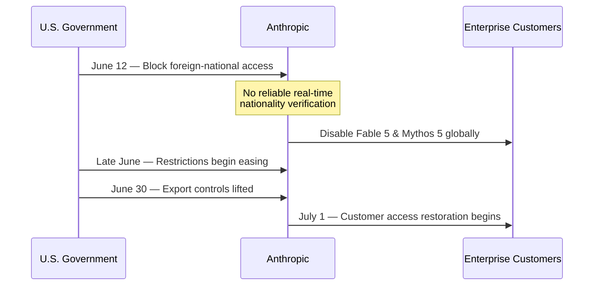

Anthropic and OpenAI have crossed a threshold that has little to do with their eventual ticker symbols.

[Anthropic confidentially submitted a draft S-1 on June 1, 2026](https://www.anthropic.com/news/confidential-draft-s1-sec). [OpenAI followed exactly one week later](https://openai.com/index/openai-submits-confidential-s-1/). Anthropic had recently been valued at roughly $965 billion, while OpenAI's reported valuation was above $850 billion. Whatever prices the public markets eventually assign them, these would be among the largest technology listings ever attempted.

For enterprise customers, however, valuation is not the most interesting number.

These companies increasingly sit inside production workflows, coding environments, decision-support systems, customer operations, and agentic architectures. An IPO therefore does more than create liquidity for investors. It adds a new constituency — public shareholders — to organizations already balancing commercial growth, safety commitments, government intervention, and increasingly complicated governance structures.

Going public does not necessarily make a safety-oriented AI company less safe. But it **converts previously internal tensions into externally priced constraints**.

For enterprise risk teams, three pressure points deserve particular attention.

## 🏗️ Pressure Point 1: The PBC Architecture Has Its First Precedent — But Not Its AI Test

Anthropic is not structured like an ordinary technology company.

It operates as a Delaware Public Benefit Corporation (PBC), whose directors must balance three interests: stockholders' pecuniary interests, the interests of those materially affected by the corporation's conduct, and the specific public benefit identified in its charter.

Anthropic defines that purpose as:

> "the responsible development and maintenance of advanced AI for the long-term benefit of humanity."

Layered on top of the PBC is Anthropic's [Long-Term Benefit Trust](https://www.anthropic.com/news/the-long-term-benefit-trust), an independent body composed of financially disinterested members. The Trust was designed to gain authority over the selection and removal of an increasing portion of Anthropic's board, ultimately allowing it to elect a majority.

The intent is clear: create structural protection against a future in which commercial incentives overwhelm the company's safety mission.

But an IPO introduces a new tension.

Public investors are purchasing an economic interest in a company whose governance architecture is deliberately designed to constrain ordinary shareholder influence when financial returns conflict with the company's stated public benefit. And the structure may become more complicated still: [Reuters reported in August that Anthropic was considering supervoting rights for its founders ahead of an IPO](https://www.reuters.com/business/anthropic-prepares-supervoting-power-founders-ahead-ipo-information-reports-2026-08-18/).

That could leave Anthropic with an unusual three-way control architecture:

```text
Public shareholders
        ↕
     Founders
        ↕
Long-Term Benefit Trust
```

Until recently, one could reasonably describe the legal consequences of this architecture as almost entirely untested.

That changed on July 29.

In *Drakes Landing Associates LP v. Tilden Park Capital Management LP*, the [Delaware Court of Chancery issued an important early interpretation of PBC director duties](https://www.reuters.com/legal/government/delaware-judge-rules-public-benefit-corporations-exempt-maximizing-value-sale-2026-07-29/). In the context of a change-of-control transaction, the court rejected the idea that directors of a PBC must simply maximize shareholder value in the manner traditionally associated with an ordinary corporation. The statutory balancing obligation mattered.

That is significant for Anthropic.

It suggests that the PBC structure is not merely mission language attached to an otherwise conventional corporation. Delaware courts may give the balancing mandate substantive legal effect.

But *Drakes Landing* was not about frontier AI.

No court has yet had to decide what the PBC balancing obligation means when an AI company voluntarily delays a lucrative model release, refuses a major customer, spends billions on safety research, limits an autonomous capability, or accepts a material revenue loss because management believes the alternative creates unacceptable societal risk.

So the uncertainty has narrowed, but it has not disappeared.

The question is no longer whether the PBC form has legal teeth.

It is **what those teeth look like when safety decisions at a trillion-dollar AI company collide with shareholder economics**.

For enterprise procurement and risk teams, Anthropic's eventual public filings therefore deserve to be read as governance documents, not merely financial disclosures. Risk factors describing the Trust, founder voting rights, PBC obligations, board composition, and conflicts between public benefit and shareholder returns may matter as much as revenue growth.

## 🌐 Pressure Point 2: The Export-Control Episode Rewrites Vendor Reliability Assumptions

The most operationally consequential AI risk event of 2026 may not have been a benchmark failure or a model hallucination.

It was an 18-day global outage.

On June 12, the U.S. government directed Anthropic to prevent foreign nationals — including foreign-national employees inside the company — from accessing Fable 5 and Mythos 5.

The distinction between the government's order and what happened next matters.

The government did **not** initially order Anthropic to disable the models for every customer worldwide. It required Anthropic to block access by foreign nationals.

But the restriction took effect immediately. Anthropic said it lacked a reliable mechanism to verify users' nationality in real time. Faced with a regulatory requirement it could not reliably enforce at the identity layer, the company disabled both models for everyone.

That turned a targeted export-control requirement into a global service interruption.

For enterprise risk teams, this is the critical point.

The outage was not caused by failed servers, insufficient capacity, a cyberattack, or defective code. It emerged from the interaction of **geopolitical regulation and a technical control limitation**.



That distinction changes the vendor-risk analysis.

Traditional third-party resilience assessments tend to focus on uptime, cybersecurity, disaster recovery, concentration risk, financial condition, and subcontractors. Frontier AI introduces another failure mode:

**a government can alter the usability of a globally deployed model faster than either the vendor or its customers can redesign the surrounding control architecture.**

As Forrester has argued in its [analysis of sovereign AI](https://www.forrester.com/blogs/sovereign-ai-is-about-control-not-localization/), sovereignty is increasingly about control rather than simply where infrastructure is physically located.

The Anthropic episode makes that argument concrete.

Jurisdiction risk is not confined to Chinese AI vendors, sanctioned jurisdictions, or locally hosted models. It applies to U.S. frontier-model providers as well — particularly from the perspective of multinational customers whose production systems depend on uninterrupted access.

I explored the regulatory implications of the episode in [After the Shutdown: What Fable 5's Restoration Actually Settled](https://minwu-ai.github.io/after-the-shutdown-what-fable-5-s-restoration-actually-settl/). The Commerce Department's reversal demonstrated how existing national-security authorities can govern frontier AI even before dedicated AI regulatory institutions have fully matured.

The IPO adds another variable.

A privately held mission-driven company can publicly contest government intervention while absorbing some degree of commercial disruption. A listed company must also consider the market reaction to an outage, customer churn, revenue guidance, analyst questions, and shareholder expectations.

That does not mean Anthropic would necessarily accommodate the government more readily next time.

It means the incentive environment would be different.

For enterprise customers, the appropriate response is not to predict how Anthropic will behave. It is to stop assuming that model availability is exclusively an engineering problem.

## 📊 Pressure Point 3: Will Public Markets Change the Economics of Safety Research?

The commercial stakes are already enormous.

According to [Ramp's July 2026 data](https://ramp.com/data/ai-index-august-2026), 43.5% of U.S. businesses in its dataset were paying for Anthropic, compared with 39.7% for OpenAI. Ramp's index is based on aggregated corporate-card and bill-pay activity across more than 70,000 U.S. businesses.

That is an important qualification: these figures describe **Ramp's customer dataset**, not 43.5% of all U.S. companies.

The model-level data reveal a second distinction.

Within OpenAI usage observed by Ramp, GPT-5.6 Sol accounted for roughly 25% of tokens and 23% of spend. Fable 5 represented approximately 6% of Anthropic tokens and 11.4% of Anthropic spend.

Those percentages are within-vendor shares, not shares of the entire enterprise AI market.

But together the numbers raise an interesting question.

Anthropic currently appears to have exceptional **breadth of enterprise adoption**, while OpenAI's newest flagship model appears to command substantially greater usage depth within its own customer base.

In private markets, those differences can be discussed in terms of long-term strategy.

Public markets eventually translate them into recurring questions:

How quickly is usage growing?

What is revenue per customer?

What is inference margin?

How much compute is being allocated to research rather than commercially monetizable workloads?

Which research programs contribute to product differentiation?

And which ones are simply costs?

There is no clean historical comparison here. No frontier AI laboratory with Anthropic's safety mission, governance structure, capital requirements, and potential valuation has previously entered public markets at this scale.

That is precisely why the allocation question matters.

Safety research already carries an opportunity cost today. Anthropic does not need an IPO for management to choose between interpretability research, alignment experiments, capability development, inference capacity, and commercial product work.

What changes after listing is that the tradeoff becomes **externally observable and repeatedly priced**.

```text
Private company
Mission ←→ Growth

Public company
Mission ←→ Growth ←→ Shareholders
                 ↕
             Regulators
                 ↕
        Geopolitical exposure
```

A safety program whose payoff may arrive five years from now can suddenly be compared against an inference optimization project that improves gross margin this quarter.

That does not establish that Anthropic will cut safety research.

It establishes something narrower and more important for governance analysis:

**the economic pressure acting on the allocation decision changes.**

The risk is therefore not simply "Wall Street will make Anthropic less safe." That claim would be speculative.

The governance question is whether the PBC, the Long-Term Benefit Trust, founder control, board oversight, and public disclosures together provide enough structural protection for long-horizon safety investments when their opportunity costs become increasingly visible.

## ⚖️ The IPO Converts Latent Tensions Into Enterprise Risks

Taken separately, none of these developments proves that going public will make Anthropic or OpenAI less safe.

The governance risk is still largely prospective.

The geopolitical availability risk has already been demonstrated.

The safety-budget risk remains a hypothesis that can only be tested over time.

But the IPO matters because it connects them.

Before public ownership, many of these tensions live primarily inside the company: between researchers, executives, investors, boards, and government relationships.

After an IPO, another feedback loop appears.

Revenue growth, margins, outages, capital expenditures, governance disputes, research spending, and regulatory interventions become information that markets continuously price.

For enterprise customers, that changes the appropriate vendor-risk question.

It is no longer enough to ask:

> **Is this model safe and reliable today?**

The more durable question is:

> **What forces will determine how this company behaves when safety, availability, government demands, and commercial incentives point in different directions?**

That question applies to both Anthropic and OpenAI, even though their corporate structures differ substantially.

And as frontier models become embedded deeper into enterprise infrastructure, understanding the answer may become as important as evaluating the models themselves.
