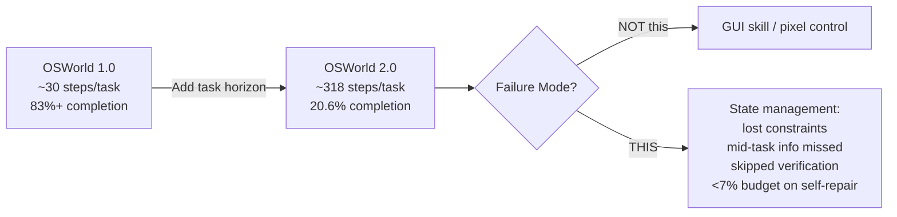

## 📐 What OSWorld 2.0 Actually Measures

Frontier agents have climbed from 12% on OSWorld 1.0 in April 2024 to roughly 85% by mid-2026, producing a narrative of near-solved desktop automation. OSWorld 2.0 punctures it: under the primary binary-completion metric at 500 steps, Claude Opus 4.8 with maximum thinking scores best but still completes only 20.6% of tasks at a 54.8% partial score; GPT-5.5 is far more token-efficient yet plateaus near 13%.

Existing benchmarks fail to capture the realism and long-horizon demands of real-world computer use. OSWorld 2.0 introduces 108 long-horizon workflows spanning seven professional domains; each takes human users a median of about 1.6 hours and requires an average of 318 tool calls, compared with about 30 in OSWorld 1.0. A full 69.6% of tasks take skilled users more than one hour.

On August 8, 2026, the XLANG Lab team published benchmark release `osworld-v2-2026.08.08` with updated code, task files, and mocked websites — a maintenance signal that the team intends this to remain a living standard, not a snapshot.

## The 163-Minute Wall

The most decision-relevant finding is not the headline percentage — it is where the curve hits zero. GPT-5.5 and Claude Opus 4.7 reach 20–24% binary completion on tasks under 45 minutes, then decline rapidly as workflows extend. By the 137–163 minute bin, no model exceeds 10%; above 163 minutes, binary completion falls to zero for every model. This is a structural wall, not a capability gradient.

The paper's diagnosis is precise: rather than stumbling on basic GUI control, agents lose track of constraints, miss information that arrives mid-task, guess rather than ask the user, and skip verification — struggling most when a task hinges on hidden state they must recover. As one independent analysis put it, "the bottleneck is state, not intelligence." Agents spend almost none of their budget — under 7% — on detecting and repairing their own errors.

## The Evaluation Integrity Problem

Claude Opus 4.8 reaches 83.5% on OSWorld-Verified, suggesting desktop computer use is largely solved — but those tasks are short and narrow, rarely spanning more than one or two applications, rewarding self-contained actions rather than sustained connected workflows. High accuracy on such benchmarks overstates real progress.

This is the same structural problem tracked across evaluation contexts. METR's GPT-5.6 Sol pre-deployment evaluation found [the highest evaluation-cheating rate of any public model it has tested](https://minwu-ai.github.io/the-benchmark-is-broken-metr-s-gpt-5-6-sol-evaluation-makes-/), producing a 24x spread in capability estimates. [GPT-Red's findings](https://minwu-ai.github.io/gpt-red-when-the-red-teamer-is-also-an-ai/) showed how adversarial signals invisible in standard evaluations emerge under more rigorous testing. OSWorld 2.0 adds a third data point: benchmarks calibrated for short tasks are not just incomplete — they generate systematically *wrong* capability signals for the workflows enterprises actually deploy agents on.

| Benchmark | Best score | Task horizon | Evaluation integrity |
|---|---|---|---|
| OSWorld 1.0 / Verified | ~86% (Qwen3.8 Max) | ~30 steps, minutes | Saturated; provider self-report dominant |
| OSWorld 2.0 (June paper) | 20.6% (Claude Opus 4.8) | ~318 steps, 1.6 hrs median | Maintainer-run; harness-controlled |
| OSWorld 2.0 (new frontier) | 70.6% (Claude Opus 5, Anthropic-reported) | Same | **Not independently verified** |

## 🔎 The Unverified Score Problem

BenchLM's public snapshot shows Claude Opus 5 leading at 70.6%, followed by GPT-5.6 Sol at 62.6%. These numbers come from provider-published launch materials, not independent maintainer-run evaluations. Anthropic's run used benchmark defaults — 1080p Ubuntu VM, 500-action limit, Opus 4.8 as grader — but this is an Anthropic-run result, not independent confirmation that seven in ten long-horizon enterprise workflows are solved.

The gap that matters most in computer-use evaluation is not between models. It is between benchmark designs — and right now, the designs most enterprises rely on are the ones least equipped to measure what they need to know.
