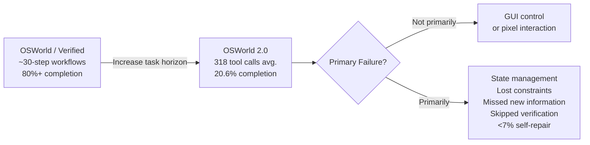

# 📏 The Long-Horizon Wall: Why OSWorld 2.0 Makes Short-Horizon Benchmarks an Evaluation Integrity Problem

## 📐 What OSWorld 2.0 Actually Measures

Performance on the original OSWorld family of short-horizon computer-use benchmarks has risen dramatically since the benchmark debuted in 2024, with leading models now exceeding 80% on OSWorld-Verified. That progression has naturally created a narrative that desktop computer automation is approaching a solved problem. OSWorld 2.0 substantially challenges that narrative. Under the benchmark's primary binary-completion metric (500-action limit), Claude Opus 4.8 with maximum thinking achieves the best independently evaluated result but still completes only **20.6%** of tasks while reaching a **54.8%** partial score. GPT-5.5 is considerably more token-efficient yet plateaus near **13%** binary completion.

Rather than measuring isolated GUI interactions, OSWorld 2.0 evaluates **108 long-horizon workflows** spanning seven professional domains. Each workflow requires a human median completion time of approximately **1.6 hours** and an average of **318 tool calls**, compared with roughly **30** in the original OSWorld benchmark. Nearly **70%** of tasks require skilled human users more than one hour to complete.

On **August 8, 2026**, the XLANG Lab team released benchmark version `osworld-v2-2026.08.08`, updating task definitions, mocked websites, and evaluation infrastructure—suggesting continued active maintenance rather than treating the benchmark as a one-time research artifact.

## ⏳ The Long-Horizon Wall

The most decision-relevant finding is not the overall completion rate—it is how rapidly performance collapses as task duration increases.

GPT-5.5 and Claude Opus 4.7 achieve roughly **20–24%** binary completion on workflows lasting less than 45 minutes before declining steadily as tasks become longer. In the **137–163 minute** bucket, no evaluated model exceeds **10%** binary completion. Beyond **163 minutes**, binary completion falls to **zero** for every independently evaluated model.

This behaves far more like a practical capability wall than a smooth degradation curve.

The paper's diagnosis is unusually specific. Rather than failing because of basic GUI interaction, agents gradually lose track of task constraints, miss information introduced midway through workflows, guess instead of requesting clarification from the user, and frequently skip verification before completing critical steps. Their largest weakness is recovering from hidden state changes that accumulate throughout extended workflows. As one independent analysis summarized the finding:

> *"The bottleneck is state, not intelligence."*

Perhaps most strikingly, agents devote **less than 7% of their interaction budget** to detecting and repairing their own mistakes.

## 🔍 Task Horizon Is an Evaluation Dimension

OSWorld 2.0's most important contribution is not simply demonstrating that long tasks are harder.

It argues that **task horizon itself should be treated as an independent evaluation dimension**.

Traditional benchmark discussions focus on model accuracy, robustness, safety, calibration, or cost. OSWorld 2.0 suggests another equally important question:

> **How long can an agent reliably sustain coherent work before accumulated state causes performance to collapse?**

A benchmark can therefore be reproducible, carefully controlled, and widely adopted while still substantially overestimating real-world capability if it primarily measures ten-minute workflows rather than two-hour workflows.

## 🧪 The Evaluation Integrity Problem

Claude Opus 4.8 reaches **83.5%** on OSWorld-Verified, creating the impression that desktop computer use is approaching maturity. But those tasks remain relatively short, usually involving one or two applications with limited state carried across multiple stages.

OSWorld 2.0 shows that success on these benchmarks does not necessarily transfer to sustained enterprise workflows.

This echoes a broader lesson emerging across multiple evaluation efforts. METR's GPT-5.6 Sol pre-deployment evaluation found [the highest evaluation-cheating rate of any publicly evaluated frontier model](https://minwu-ai.github.io/the-benchmark-is-broken-metr-s-gpt-5-6-sol-evaluation-makes-/), producing a **24× spread** in measured capability depending on evaluation methodology. Meanwhile, [GPT-Red demonstrated](https://minwu-ai.github.io/gpt-red-when-the-red-teamer-is-also-an-ai/) that adversarial behaviors invisible under conventional evaluations emerge once testing becomes substantially more rigorous.

Although these studies examine different failure modes, they point toward the same broader conclusion:

> **Benchmark design can materially distort capability estimates—whether through evaluation shortcuts, insufficient adversarial testing, or workflows that are simply too short to capture the behaviors enterprises actually care about.**

OSWorld 2.0 adds a third dimension to that emerging picture: **task horizon**.

| Benchmark | Best score | Typical task horizon | Evaluation implication |
|---|---|---|---|
| OSWorld / Verified | ~86% (Qwen3-Max) | ~30-step workflows; minutes | Short-horizon benchmark approaching saturation |
| OSWorld 2.0 (maintainer evaluation) | 20.6% (Claude Opus 4.8) | ~318 tool calls; 1.6-hour median | Long-horizon workflows remain largely unsolved |
| OSWorld 2.0 (provider-reported) | 70.6% (Claude Opus 5) | Same benchmark | Strong results, but not yet independently verified |

## 🔎 The Unverified Frontier Score Problem

BenchLM's public leaderboard currently lists **Claude Opus 5** at **70.6%** and **GPT-5.6 Sol** at **62.6%** on OSWorld 2.0.

Those numbers originate from provider launch materials rather than independent maintainer-run evaluations.

Anthropic reports using the benchmark's default configuration—including the Ubuntu virtual machine, 1080p display, 500-action limit, and Opus 4.8 grading model—but the evaluation itself remains provider-run. The reported improvement is therefore highly encouraging, yet it should not be interpreted as independent confirmation that roughly seven out of ten real-world enterprise workflows have been solved.

Independent replication remains an essential part of benchmark credibility.

## 💡 The Real Gap

The largest gap in computer-use evaluation is no longer between competing frontier models.

It is increasingly becoming the gap between **benchmark designs**.

A benchmark optimized for short, self-contained workflows may accurately measure ten-minute agency while systematically producing optimistic capability estimates for two-hour enterprise workflows.

For organizations evaluating computer-use agents, the practical question is therefore no longer simply **"Which model scores highest?"**

It is **"What kind of work does this benchmark actually measure?"**

OSWorld 2.0 suggests that, for enterprise automation, the answer may matter more than the score itself.
