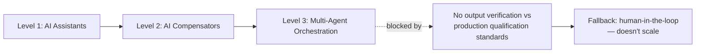

## The number that should reset the conversation

Seven out of twelve. That is how many companies in a new interview study sit at the lowest rung of agentic AI maturity — "AI Assistants," Level 1 of a six-level framework — while only one has reached Level 3, multi-agent orchestration. The [study](https://arxiv.org/abs/2605.14675), from researchers at Chalmers University of Technology, Eindhoven University of Technology, and Malmö University, is built on sixteen practitioner interviews across a dozen real companies of varying size and domain, not a vendor-commissioned survey of buying intent. That distinction matters more than it sounds.

Most of what shapes the public narrative on agentic adoption is self-reported sentiment: Gartner's polling of webinar attendees, PagerDuty's executive surveys, IDC studies commissioned by cloud vendors. This paper instead asked what companies have actually built and shipped, then placed each on a structured maturity ladder. The findings reveal that seven companies operate at Level 1 (AI Assistants), four companies at Level 2 (AI Compensators), and only one in Level 3 (Multi-Agent Orchestration), with large and safety-regulated organizations among the most advanced adopters.

## The gap the surveys can't see

The paper's central contribution isn't the maturity count — it's the mechanism behind the stall. The primary finding is a capability-deployment verification gap, four companies demonstrated higher-level experimental AI capabilities but cannot integrate them into production workflows because adequate output verification mechanisms are absent, leaving human-in-the-loop as the only trusted verification mechanism. In plain terms: four organizations built agents that work in demos and pilots, and shelved them anyway, because nobody has a way to automatically check an agent's output against the qualification standards production systems require.

The researchers trace this to four recurring, concrete barriers: context window of LLMs constraints especially when diverse knowledge aggregation is needed, under-performance on proprietary programming languages and protocols, non-determinism incompatible with qualification standards, and data confidentiality concerns. Note what's absent from that list: raw model capability. These are integration and verification problems, not intelligence problems — a distinction the vendor hype cycle routinely collapses.

## Where this lines up with — and against — the market narrative

Gartner's own [June 2025 forecast](https://www.gartner.com/en/newsroom/press-releases/2025-06-25-gartner-predicts-over-40-percent-of-agentic-ai-projects-will-be-canceled-by-end-of-2027) that over 40% of agentic AI projects will be canceled by 2027 gestures at the same phenomenon from the demand side, citing escalating costs and inadequate risk controls, and warning about "agent washing." A [July 2026 Forbes analysis](https://www.forbes.com/sites/robertszczerba/2026/07/07/why-40-of-agentic-ai-projects-may-be-canceled-by-2027/) revisiting that prediction even borrows the paper's own language, noting that companies face a "capability-deployment verification gap" as pilots falter in production. Gartner's 2026 Hype Cycle adds a data point that rhymes uncomfortably well with the twelve-company sample: only [17% of organizations](https://www.ihlservices.com/news/analyst-corner/2026/06/gartner-predicts-40-of-agentic-ai-projects-will-be-canceled-by-2027-heres-what-the-retail-store-level-shows/) have deployed AI agents at all, against 60%+ expecting to within two years.

Where the sources diverge is causal attribution. Gartner frames the shakeout as a management and governance failure — "misapplied" hype, weak strategy. This paper locates the blocker one layer deeper: even well-governed, well-resourced companies (the paper notes safety-regulated and large organizations are the most advanced adopters, not the laggards) hit a wall because the verification infrastructure for agentic outputs simply doesn't exist yet. That's a harder problem than a governance fix — it's a missing category of tooling.

## Why this complicates the ROI story

This finding sits directly downstream of the broader maturity-versus-usage question this site has tracked before. Google's [ATLAS v1.0 study](https://minwu-ai.github.io/google-s-atlas-v1-0-15-million-interactions-show-ai-adoption/) found AI usage is broad but shallow at the task level; this paper finds the same shallowness at the deployment-architecture level — most companies never progress past assistant-tier agentic use regardless of how broadly employees touch the tools.
