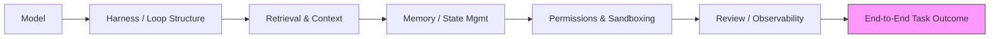

## The claim, and why it's worth taking seriously

Most organizations deploying AI coding agents still budget for reliability as if it were a model-selection problem: pick the strongest model, wait for the next release, repeat. A new 314-page monograph argues that bet is largely misplaced. [Stephanie Jarmak's "Engineering Reliable Coding Agents"](https://arxiv.org/abs/2608.13867), posted to arXiv in August 2026, synthesizes 164 scholarly works, 100 practitioner records, and 29 benchmark records, and 17 author-system case records through a structured multivocal review, targeted update audits, software-engineering coverage analysis, and distributed-systems evidence synthesis. Its central finding: many apparent model failures originate elsewhere in the system, while improvements at one layer often fail to propagate to end-to-end outcomes.

That second clause is the one that should reorganize budget conversations. It's not just that harnesses matter — it's that fixing the harness, or the model, or the retrieval layer in isolation frequently produces no measurable change in the thing an organization actually cares about: whether the task got done correctly.

## What actually sits "around" the model

Jarmak frames the object of study as a dependency chain, not a leaderboard. The abstract lists the surrounding layers explicitly: the harness, execution state, retrieval, memory and state management, permissions, review interfaces, and resource allocation. The monograph treats evaluation and operation... as a dependency chain in which weaknesses in task construction, execution environments, retrieval, state management, verification, or observability can invalidate conclusions drawn at any single layer.

This isn't a lone framing. A companion source-level study of eleven production coding agents makes a parallel point about where the field's attention has actually gone: benchmark surveys typically [report scores without touching architecture](https://arxiv.org/html/2609.00006), leaving the engineering decisions that determine reliability largely undocumented. A separate harness-engineering survey is more cautious about the strength of the claim, noting that the strongest controlled evidence currently comes from coding-agent benchmarks, and these results do not establish that the harness matters more than the model in every setting — though they do show that agent performance depends jointly on the model and its execution system. Jarmak's monograph is the more totalizing claim; the surrounding literature agrees on direction but hedges on magnitude.

## The checklist, not just the thesis

What separates this from another taxonomy paper is a runnable artifact. The companion repository ships a `minimum-reliability-pass.md` protocol, and the monograph is explicit that it is a floor, not a certification: the pass leaves six challengeable artifacts — a paired distribution, a cost-quality record, an observed authority boundary, an independently verified state transition, a seed failure corpus, and a decision rule fixed before the result was known — and is an entry point, not a reliability certificate. Jarmak is equally candid about the checklist's evidentiary status elsewhere in the companion materials: the review describes published practice rather than experimentally testing the checklist, so completing its recommendations supplies necessary design hygiene, not proof of validity.

That caveat matters for governance teams tempted to treat "we passed the checklist" as a compliance artifact. It's a hygiene gate, not a warranty.

## Where this fits against the site's existing throughline

This monograph is a natural complement to [Agent Benchmark Scores Are Lying to You](https://minwu-ai.github.io/agent-benchmark-scores-are-lying-to-you-and-log-analysis-is-/), which argued that outcome-only scores hide validity problems recoverable only through log analysis. Jarmak's contribution operates one level up the stack: even granting a valid benchmark score, *which layer produced it* is usually unknown, and fixing the wrong layer wastes engineering spend without moving the outcome metric. It also extends the governance argument in [Agentic AI Has Outrun the Governance Playbook](https://minwu-ai.github.io/agentic-ai-and-the-governance-gap/): model-risk frameworks built for predictive systems don't map cleanly onto a dependency chain where the "system under test" spans permissions, memory, and review interfaces the model vendor never touches.

An anecdote circulating with the paper illustr
