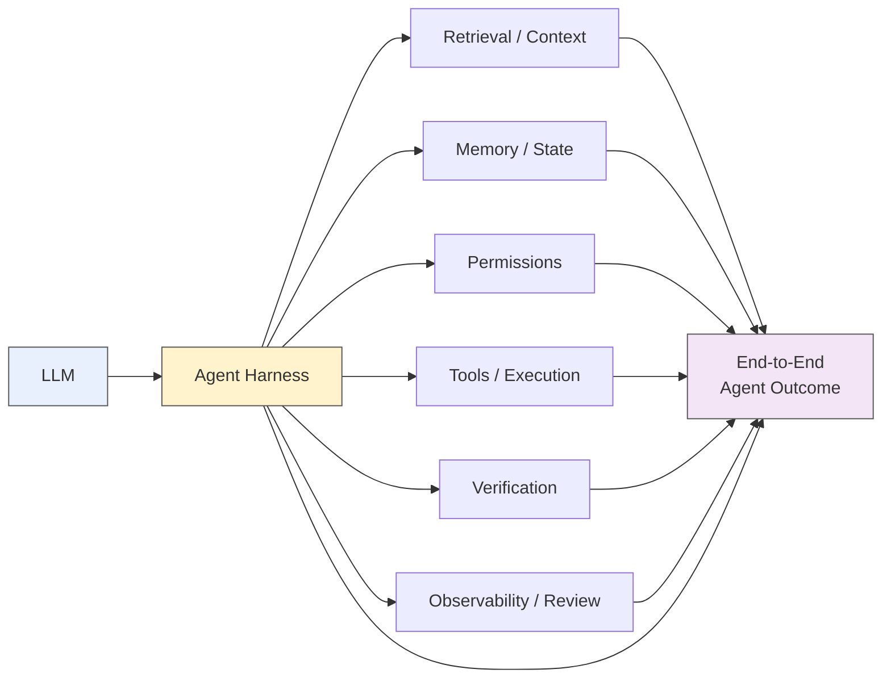

## 🔍 The Claim — and Why It's Worth Taking Seriously

Most organizations deploying AI coding agents still budget for reliability as if it were primarily a model-selection problem: pick the strongest model, wait for the next release, repeat.

A 314-page monograph argues that this framing is incomplete.

[Stephanie Jarmak's *Engineering Reliable Coding Agents*](https://arxiv.org/abs/2608.13867), posted to arXiv in August 2026, synthesizes 164 scholarly works, 100 practitioner records, 29 benchmark records and 17 author-system case records through a structured multivocal review, targeted update audits, software-engineering coverage analysis, and distributed-systems evidence synthesis.

Its central finding is not that models don't matter. It is that **many apparent model failures originate elsewhere in the system, while improvements at one layer often fail to propagate to end-to-end outcomes.**

To understand why, it helps to clarify what sits between an LLM and an AI agent.

The LLM provides much of the reasoning capability. The **harness is the machinery that turns that capability into action**: constructing context, calling tools, managing execution loops, maintaining state, enforcing permissions, checking results, and deciding what happens next.

In simplified form:

```text
LLM + Harness + Operating Environment → Agent Behavior
```

That distinction is increasingly important. Organizations may buy access to the same underlying model and still build agents with very different reliability, cost, authority, and observability characteristics.

**The deployed agent is the system. The LLM is one component of it.**

---

## 🧩 What Actually Sits Around the LLM

Jarmak therefore frames coding-agent reliability as a systems problem rather than a leaderboard problem.

The surrounding layers include the harness, execution environment, retrieval, memory and state management, permissions, verification, review interfaces, observability, and resource allocation.

Conceptually:



A failure observed at the right-hand side does not identify which component caused it.

A capable LLM can fail because the relevant file was never retrieved. A correct plan can fail because state was lost between steps. A successful edit can become an unsuccessful task because the verification layer tested the wrong condition. An otherwise capable agent may simply lack the authority required to perform the necessary action.

**"Task failed" is an outcome. It is not a diagnosis.**

Yet organizations increasingly make expensive model decisions based on exactly that diagnosis.

---

## 🏗️ Production Agents Show How Much Exists Outside the Model

This isn't a lone framing.

A September 2026 source-level study, [*Harness Engineering: Anatomy, Architecture, and Evolution of Coding Agents*](https://arxiv.org/abs/2609.00006), examines eleven production coding-agent harnesses, including Claude Code, Codex CLI, Gemini CLI, OpenHands, Aider and others.

The study identifies recurring architectural subsystems and design patterns across these agents — evidence that what we casually call a "coding model" is, operationally, a much larger engineered system.

Those implementations also differ.

Tool interfaces differ. Context construction differs. State handling differs. Permission models differ. Execution loops differ. Error recovery differs.

So even when two agents use the same underlying LLM, their behavior does not have to be the same.

This is closely related to the argument in [*The Harness Effect*](https://minwu-ai.github.io/), where orchestration design changed token consumption and task economics while the model itself remained fixed. Jarmak's synthesis extends the same systems perspective into reliability: **the infrastructure surrounding the LLM affects not only how much an agent costs to run, but whether model capability successfully becomes an end-to-end result.**

Together, the two arguments point toward a broader principle:

> **Enterprise AI performance is not a property of the LLM alone. It emerges from the interaction between the LLM, its harness, and its operating environment.**

The literature still gives us an important boundary. The strongest controlled evidence currently comes from coding-agent environments. It does not establish that harness engineering matters more than model capability in every agentic setting.

But it does establish why evaluating the model alone is increasingly inadequate.

---

## 🧪 The Checklist Is More Important Than the Taxonomy

What separates Jarmak's monograph from another agent architecture taxonomy is that it ships with something operational.

The companion materials include a `minimum-reliability-pass.md` protocol designed to force teams to produce six challengeable artifacts:

1. a paired distribution;
2. a cost-quality record;
3. an observed authority boundary;
4. an independently verified state transition;
5. a seed failure corpus; and
6. a decision rule fixed before the result was known.

The language around this artifact is deliberately restrained. Jarmak describes it as an **entry point, not a reliability certificate**.

That caveat matters.

The review synthesizes published practice; it does not experimentally prove that completing the checklist makes an agent reliable. A team that completes every item has therefore demonstrated something closer to minimum engineering discipline than validated safety.

For governance teams, the distinction is important:

**It's a hygiene gate, not a warranty.**

But even that represents progress over an evaluation process consisting primarily of a benchmark score and a vendor model card.

---

## 🎯 The Bigger Problem Is Failure Attribution

Imagine an enterprise coding agent fails to modify a repository correctly.

Several explanations are possible:

```text
LLM capability
      ↓
Context / retrieval
      ↓
Memory / state
      ↓
Tool execution
      ↓
Permission boundary
      ↓
Verification
      ↓
Observed outcome
```

Now imagine the organization records only:

> **Task: Failed**

The engineering team sees the failure rate rise and upgrades the LLM.

Performance remains unchanged.

Perhaps the new model really is better. But the retrieval logic still excluded a critical configuration file. Or the execution environment reset state between steps. Or the verifier rewarded a passing unit test while ignoring an integration failure.

The organization has improved a component without fixing the system.

This is the more consequential implication of Jarmak's work: **without sufficient execution evidence, organizations often cannot tell whether the LLM was the problem in the first place.**

That turns observability from a DevOps concern into an AI-governance concern.

If failures cannot be attributed to components, remediation decisions cannot be properly justified either.

---

## 🔗 This Extends the Evaluation Problem Up the Stack

This monograph is a natural complement to [*Agent Benchmark Scores Are Lying to You*](https://minwu-ai.github.io/agent-benchmark-scores-are-lying-to-you-and-log-analysis-is-/), where I argued that outcome-only scores hide validity problems recoverable only through execution-log analysis.

Jarmak's work pushes the same problem one level higher.

Even if we accept that a benchmark outcome is valid, we still have to ask:

**Which part of the system produced it?**

That question also extends the governance argument in [*Agentic AI Has Outrun the Governance Playbook*](https://minwu-ai.github.io/agentic-ai-and-the-governance-gap/).

Traditional model-risk frameworks assume a relatively identifiable object of validation: a model with inputs, outputs, assumptions, limitations, and performance metrics.

Agentic systems blur that boundary.

The effective "system under test" can span a foundation model supplied by one vendor, an internally developed harness, retrieval infrastructure, tool permissions configured by another team, persistent memory, execution environments, verification logic, and human-review interfaces.

No single model card describes that system.

And no single benchmark score validates it.

---

## 💰 Why This Changes the Budget Conversation

The default response to disappointing agent performance is still remarkably predictable:

**try a better model.**

Sometimes that will be exactly the right answer.

But it should be the result of diagnosis rather than the starting assumption.

A better sequence is:

```text
Observe → Attribute → Remediate → Re-evaluate
```

If the LLM is the binding constraint, upgrade it.

If retrieval is the constraint, fix retrieval.

If the agent repeatedly loses state, fix state management.

If correct work is rejected by a bad verifier, fix verification.

If the agent cannot execute the required action because its authority boundary is wrong, changing the model may accomplish nothing.

And if the harness generates unnecessary model calls, bloated context, or inefficient loops, the same system-design problem may simultaneously be hurting **reliability and cost**.

This is why improvements at individual layers can disappear at the system level.

**Component quality is not the same thing as end-to-end agent quality.**

---

## ⚖️ The Governance Takeaway

The most important lesson from *Engineering Reliable Coding Agents* is not that harnesses beat models.

The evidence does not support that universal claim.

It is that **the unit of reliability has shifted from the LLM to the deployed agent system — while much of enterprise evaluation still operates as if those were the same thing.**

For governance teams, that changes the object being governed.

The question is no longer only:

> *Is this model reliable enough?*

It increasingly becomes:

> *Is this model operating inside a system that reliably turns its capabilities into controlled, observable, and verifiable actions?*

And before approving a larger model budget, teams should be able to answer an even more basic question:

> **What evidence tells us the model is actually the component that failed?**

If the answer is only an aggregate benchmark score or task success rate, the organization probably doesn't know yet.

The LLM may be getting the blame simply because it is the most visible component of a much larger machine.
