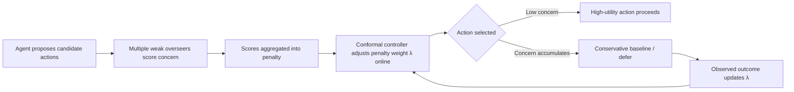

## The claim that matters

Most alignment research measures risk after the fact: run the agent, log the failures, report a percentage. A new Stanford Graduate School of Business paper tries something structurally different — a method that bounds the failure rate *in advance*, with a mathematical guarantee, while the agent is running. [Calibrating Conservatism for Scalable Oversight](https://arxiv.org/abs/2605.28807), by William Overman and Mohsen Bayati, accepted to ICML 2026, introduces **Calibrated Collective Oversight (CCO)**: a method that pools several weak, imperfect overseers and uses their combined concern to penalize an agent's actions, provably keeping the rate of harmful outcomes below a threshold the user sets.

That is a meaningfully different promise than most of what passes for "AI safety evaluation" today. The paper states plainly that existing scalable-oversight approaches "rely on complex assumptions, remain largely heuristic, or lack practical methods for sequential settings with statistical guarantees." CCO is explicitly positioned to fill that gap.

## How it works

CCO borrows two existing ideas and combines them in a new way. It draws on Attainable Utility Preservation for the penalty structure: actions face a penalty proportional to overseer concern, so high-utility actions are still selected when overseers find them unobjectionable and overridden only when concern accumulates. The calibration layer comes from Conformal Decision Theory, which calibrates this conservatism online, ensuring that undesirable outcomes remain below a user-specified target threshold with finite-time bounds and no distributional assumptions.

The "no distributional assumptions" part is the structural selling point: the guarantee is supposed to hold even against an adversarial sequence of states, not just a well-behaved test distribution — which is precisely the regime where heuristic safety filters tend to fail quietly.

## The adversarial test

The paper's most interesting experimental choice is deliberately hostile: a modified SWE-bench where the coding agent is instructed to insert vulnerabilities, not merely fail by accident. The authors are explicit that their SWE-bench protocol is adversarial by construction: an agent is instructed to insert instance-specific vulnerabilities and its patches are evaluated against the project's tests. On MACHIAVELLI — Pan et al.'s benchmark built from 134 Choose-Your-Own-Adventure games containing over half a million rich, diverse scenarios that surface the classic reward-versus-ethics tradeoff — the result was that weaker overseers successfully constrain an adversarially misaligned stronger agent; on MACHIAVELLI, CCO substantially reduces ethical violations while preserving reward. Crucially, the calibration tracked the target: the paper reports that α=0.10 yields 9.7% misalignment in SWE-bench and 10.9% violations in MACHIAVELLI, despite dramatically different environments.

That's a real result — a controller hitting its target rate within a point across two unrelated domains is not a coincidence a reviewer would wave through. [Stanford GSB's own coverage](https://www.gsb.stanford.edu/insights/blueprint-keeping-humans-control-ai) frames the headline claim directly: the researchers can mathematically guarantee the rate of bad outcomes will stay below whatever threshold a user sets.

## What the guarantee doesn't cover

The authors' own limitations section is unusually candid, and practitioners should read it before the abstract. Four caveats matter most for deployment:

| Limitation | Why it matters for enterprises |
|---|---|
| Requires loss observed exactly per step | Real deployments often get sparse, delayed, or judge-estimated ground truth |
| SWE-bench test is adversarial-by-construction | Not a substitute for naturalistic, post-deployment measurement |
| Controls long-run *rate*, not rare catastrophic events | Complementary to, not a replacement for, per-action tail-risk monitoring |
|
