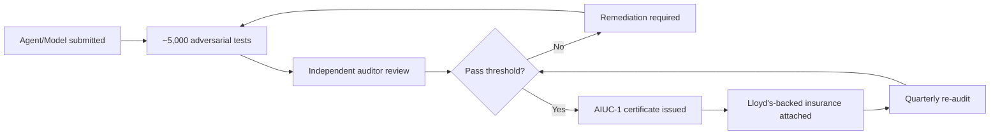

## The bottleneck has moved

AIUC's $40 million Series A, led by Ribbit Capital with First Harmonic participating, is not really a story about funding AI safety research. It's a story about where enterprises say the real constraint on AI deployment now sits — and increasingly, it isn't capability. Founder Rune Kvist, Anthropic's first product hire, has said most enterprises already have a backlog of [agents "approved in pilots" but stalled at the security review](https://siliconangle.com/2026/09/15/ai-agent-certification-startup-aiuc-raises-40m-to-begin-auditing-frontier-models/) — proof of security and reliability, not raw performance, is the bottleneck.

That framing, from a company co-founded by Kvist and former METR COO [Rajiv Dattani](https://www.kucoin.com/news/flash/ai-safety-startup-aiuc-completes-40m-series-a-funding), now underwrites a product with three layers: a certification standard (AIUC-1), a network of accredited auditors, and — the genuinely novel piece — [Lloyd's of London insurance attached directly to certification outcomes](https://finance.yahoo.com/technology/ai/articles/aiuc-raises-40m-build-certification-145719739.html). The new capital extends this stack from enterprise agents to [frontier models themselves](https://fintech.global/2026/09/17/aiuc-raises-40m-to-police-risk-in-frontier-ai-agents/), which is where this gets interesting for governance watchers, not just insurance-market observers.

## What AIUC-1 actually tests

The standard runs certified agents through [roughly 5,000 adversarial test combinations](https://finance.yahoo.com/technology/ai/articles/aiuc-raises-40m-build-certification-145719739.html) across six domains — data and privacy, security, safety, reliability, accountability, and society — with [quarterly third-party re-audits](https://thenextweb.com/news/lovable-aiuc-1-trust-centers-enterprise-procurement) rather than the annual cadence typical of frameworks like SOC 2 or ISO 42001. Customers include Cursor, Lovable, Harvey, ElevenLabs, UiPath, and KPMG, and [ElevenLabs' certified policy carried $50 million in coverage](https://forkast.news/aiuc-raises-40m-to-build-the-certification-and-insurance-layer-that-makes-agent-governance-auditable/) for losses like hallucination-driven damage and faulty tool actions.

## The UL analogy, taken seriously

Kvist draws the parallel explicitly: Underwriters Laboratories emerged in 1894 when fire insurers, worried about electrical risk at the Chicago World's Fair, [funded an independent testing lab](https://ul.org/about/our-history/) that became the industry's safety arbiter decades before most electrical codes existed. The lesson he wants readers to draw is that insurer-funded, capital-backed testing can out-pace regulation and still earn durable trust.

It's a good analogy, but an incomplete one if taken at face value. UL's authority didn't come from a single funding round — it accreted over a century through the [National Board of Fire Underwriters](https://local2507.com/about-local-2507/our-history/), eventual recognition as an [OSHA-approved Nationally Recognized Testing Laboratory](https://en.wikipedia.org/wiki/UL_(safety_organization)), and integration into building codes written by independent standards bodies. AIUC compresses that into months and self-accredits its own auditors — a point even sympathetic trade coverage flags, noting [AIUC accredits its own auditors with no external body like ANSI or UKAS](https://axipro.co/aiuc-1-certification/) currently checking its work. The UL playbook worked partly because insurers didn't also control code adoption by municipal governments; AIUC is simultaneously the standard-setter, the auditor-accreditor, and (via Lloyd's) the risk-bearer.

## Why the incentive logic still matters

That concentration is exactly what makes the insurance attachment meaningful rather than cosmetic. A certification with no downstream liability is, as one analysis put it, [just a badge](https://daily.dev/posts/aiuc-raises-40m-to-certify-and-insure-ai-agents-jqzuf37ug) — Kvist's own comparison is to mutual insurance pools among nuclear plant operators, where shared financial exposure incentivizes mutual policing. If AIUC eats losses on agents it certified, it has a genuine reason to make the 5,000 tests hard to game, not just hard to fail.

> The honest read: AIU
