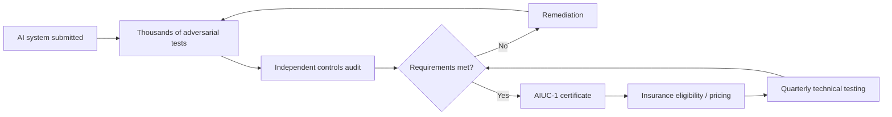

## 💰 The bottleneck has moved

AIUC's $40 million Series A, led by Ribbit Capital with First Harmonic participating, brings the company to roughly $55 million in total funding. But this isn't really a story about funding AI safety research. It's a bet about where the constraint on enterprise AI deployment is moving.

Founder Rune Kvist, Anthropic's first product hire, has said enterprises increasingly have agents that are ["approved in pilots" but stalled at the security review](https://siliconangle.com/2026/09/15/ai-agent-certification-startup-aiuc-raises-40m-to-begin-auditing-frontier-models/).

That isn't independent proof that assurance has overtaken capability as *the* enterprise bottleneck. It is AIUC's thesis about the market: companies can build useful agents faster than their security, risk, and procurement functions can become comfortable deploying them.

Co-founded by Kvist and former METR COO [Rajiv Dattani](https://www.kucoin.com/news/flash/ai-safety-startup-aiuc-completes-40m-series-a-funding), AIUC has built an unusually integrated response: the AIUC-1 certification standard, an accredited auditor ecosystem, technical testing, and insurance linked to the resulting risk assessment.

The new capital extends that model from enterprise agents toward [frontier models themselves](https://fintech.global/2026/09/17/aiuc-raises-40m-to-police-risk-in-frontier-ai-agents/).

That makes AIUC more interesting than another compliance startup.

It is trying to build a private market for **AI assurance**.

## 🧪 What AIUC-1 actually tests

AIUC-1 covers roughly 50 requirements across six domains: data and privacy, security, safety, reliability, accountability, and society.

Certified systems undergo thousands of adversarial evaluations covering risks such as prompt injection, data leakage, hallucinations, unsafe tool calls, and unreliable behavior. AIUC has described its program as involving [roughly 5,000 adversarial test combinations](https://finance.yahoo.com/technology/ai/articles/aiuc-raises-40m-build-certification-145719739.html), although the exact number varies by system and scope.

Certified systems include products from Cursor, Lovable, Harvey, ElevenLabs, UiPath, and KPMG.

The monitoring structure is also more nuanced than a simple quarterly audit. The AIUC-1 certificate has a 12-month term, while required technical testing occurs at least quarterly. Independent accredited firms can conduct the controls audit, but AIUC currently retains an important role itself: **only AIUC can perform the required quarterly technical testing**.

That distinction matters.

The insurance layer is what separates this model from a conventional compliance badge.

According to subsequent reporting, ElevenLabs' certified deployment was backed by a [$50 million insurance policy](https://forkast.news/aiuc-raises-40m-to-build-the-certification-and-insurance-layer-that-makes-agent-governance-auditable/) placed through the Lloyd's market, covering categories of loss that can include hallucination-driven damage and faulty tool actions.

The important idea isn't simply that a certified agent gets insurance.

It's that **technical evidence can influence financial risk transfer**.

## 🔥 The UL analogy, taken seriously

AIUC explicitly compares what it is building to Underwriters Laboratories.

The analogy has real historical substance.

After inspecting electrical installations at Chicago's 1893 World's Columbian Exposition, William Henry Merrill persuaded fire-insurance organizations to support an independent electrical-testing laboratory. The Underwriters Electrical Bureau began testing in 1894 and eventually became Underwriters Laboratories.

The basic economic problem looks surprisingly familiar.

A transformative technology was spreading faster than institutions understood its risks. Insurers were exposed to losses they struggled to price. Better testing could reduce uncertainty.

Private capital therefore had a reason to finance safety infrastructure.

That is the historical mechanism AIUC wants to reproduce for AI.

But the analogy becomes more interesting when taken beyond the origin story.

UL didn't become authoritative because insurers funded a laboratory in 1894. Its authority accumulated over decades through insurer support, standardized testing, integration with building and electrical codes, adoption by manufacturers and inspectors, and eventually formal regulatory recognition — including recognition as an [OSHA-approved Nationally Recognized Testing Laboratory](https://en.wikipedia.org/wiki/UL_(safety_organization)).

The familiar UL mark is therefore the visible endpoint of an enormous institutional system.

AIUC is trying to compress part of that evolution dramatically.

## ⚖️ The governance tension is built into the model

Today, AIUC occupies several positions in the assurance chain.

It maintains the AIUC-1 standard.

It decides which firms can become accredited AIUC-1 auditors.

It currently performs the required quarterly technical testing itself.

And its risk assessments feed into an insurance structure backed by outside insurance capacity.

That doesn't mean AIUC is simply "self-certifying." Independent firms perform the controls audits, creating genuine external review.

But the architecture is unusually vertically integrated.

Unlike mature certification ecosystems, there is not yet an ANSI-, UKAS-, regulator-, or equivalent external accreditation layer sitting above AIUC and independently validating the certification system itself. Even sympathetic coverage has noted that [AIUC accredits its own auditors](https://axipro.co/aiuc-1-certification/).

That creates an obvious governance question:

**Who assures the assurer?**

The UL analogy therefore cuts both ways.

AIUC resembles early UL because insurers, testing, and certification are being assembled around a poorly understood technology.

It differs from modern UL because much of the institutional scaffolding that eventually made UL authoritative does not yet exist around AIUC.

## 💵 Why the insurance link still matters

That tension doesn't make the model unimportant.

It may be exactly what makes AIUC worth watching.

Traditional certifications can become procurement checkboxes. Once passing the assessment produces the badge, the economic feedback loop becomes weak.

Insurance changes the incentive structure.

If technical testing affects whether coverage is available, how risk is priced, and how insurers experience subsequent claims, weak assurance eventually becomes a financial problem rather than merely a reputational one.

Bad testing can become bad underwriting.

That creates the possibility of a feedback loop:

**testing → certification → underwriting → losses → better testing**

Over time, claims data could reveal which evaluations actually predict real-world failures. Tests that look impressive but fail to predict losses become less valuable. Controls that correlate with fewer incidents become economically important.

That would turn assurance from a static compliance exercise into something closer to empirical risk engineering.

The idea resembles the logic behind insurance pools in other high-risk industries: actors exposed to the same class of catastrophic loss have incentives to police the standards that determine who enters the pool.

Whether AIUC can create that discipline is still an open question.

## 🏛️ Private assurance doesn't replace regulation

The tempting interpretation is that AIUC demonstrates markets can regulate AI faster than governments.

That goes too far.

The history of UL suggests almost the opposite.

Private testing can emerge before comprehensive regulation because insurers and customers have immediate economic incentives to reduce uncertainty. But durable certification regimes eventually become embedded in larger systems of standards bodies, regulators, building codes, procurement requirements, legal liability, and independent accreditation.

Private assurance and public regulation become complements.

AIUC may therefore be building something more consequential than another voluntary AI framework — but less self-sufficient than the UL analogy initially suggests.

Its real experiment is whether four functions can be connected:

**standard → technical evidence → independent audit → financial risk**

If that loop works, certification stops being merely a trust badge. It becomes information that has a price.

## 🔭 What to watch

The $40 million round doesn't prove AIUC will become the UL of artificial intelligence.

The more important questions come next.

Will insurers actually price coverage differently based on AIUC-1 results? Will claims experience change the tests? Will enterprises begin requiring certification in procurement? Will competing certification standards emerge? And eventually, will regulators or independent accreditation bodies recognize — or constrain — the system?

Those developments would tell us whether AIUC is creating another compliance framework or an institution.

**AIUC has copied an important part of the beginning of the UL story: insurers, testing, and private certification. It has not yet reproduced the institutional ecosystem that eventually made the UL mark authoritative.**

That may be the real $40 million bet.

Can underwriting discipline accelerate the creation of trusted AI assurance — or are decades of institutional legitimacy precisely the part that money cannot compress?
