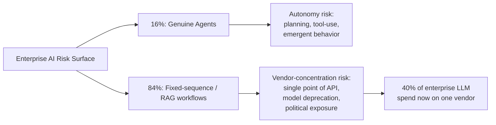

## The number that matters isn't the one getting headlines

Menlo Ventures' latest *State of Generative AI in the Enterprise* data shows [Anthropic's enterprise LLM API market share has tripled to 40%](https://menlovc.com/perspective/2025-the-state-of-generative-ai-in-the-enterprise/) since 2023, while OpenAI has fallen from 50% to 27% and Google has climbed to 21%. Most coverage has framed this as a competitive story — Anthropic "winning," OpenAI "losing." That framing misses the more consequential fact for risk and governance teams: enterprise AI exposure is now concentrated in a way it wasn't two years ago, and concentration is a risk category in its own right, independent of who happens to be ahead.

Anthropic now earns 40% of enterprise LLM spend, up from 24% last year and 12% in 2023, while OpenAI lost nearly half of its enterprise share, falling to 27% from 50% in 2023. The same report found the split is even starker in coding specifically: by 2025, Anthropic holds a commanding 54% share of the coding market, significantly higher than its overall 40% enterprise market share. Coding is not a peripheral use case — it's the wedge. Anthropic dominated coding for 18 straight months, and coding became the gateway to enterprise workflows across every department and industry, from product teams to finance to customer success.

## The agent-washing problem compounds the concentration problem

The same Menlo report contains a finding that deserves more attention than it's getting: only 16% of enterprise and 27% of startup deployments qualify as true agents — systems where an LLM plans and executes actions, observes feedback, and adapts its behavior — while most are still built around fixed-sequence or routing-based workflows wrapped around a single model call.

That matters for governance in a specific way. Most enterprise "agentic AI" risk registers are built for autonomous, adaptive systems — the kind I described as breaking traditional model-risk assumptions in [Agentic AI Has Outrun the Governance Playbook](https://minwu-ai.github.io/agentic-ai-and-the-governance-gap/). But if 84% of what enterprises actually run is closer to deterministic pipelines than genuine autonomy, the dominant *practical* risk today isn't emergent agent behavior — it's plain old vendor dependency, at a scale most procurement processes were never built to price in.

## The Pentagon episode is the concentration-risk case study governance teams should study

If you want a live-fire example of what single-vendor dependency actually costs, look no further than the U.S. government's own AI supply chain this year. In March, the Department of Defense [designated Anthropic a "supply chain risk"](https://www.aljazeera.com/economy/2026/3/9/anthropic-sues-trump-administration-to-undo-us-supply-chain-risk-tag) and directed federal agencies to stop using its products, after negotiations over autonomous-weapons and surveillance guardrails collapsed. In August, [a federal judge ruled the designation unlawful](https://www.cnbc.com/2026/08/28/judge-blocks-pentagon-blacklist--anthropic-.html), finding it amounted to retaliation rather than a genuine security assessment.

Set aside the constitutional merits. The operational lesson stands regardless of outcome: a government function that had come to rely heavily on one vendor's models faced a real possibility of losing access "overnight," with no transition plan, purely on the strength of a political dispute unrelated to model performance or safety incidents. Industry commentary drew the obvious line to enterprise buyers: the conflict shows how provider concentration can become operational risk without a transition plan — if your company lost access to an AI provider overnight, could your operations keep running?

## What this means for model-risk and vendor-due-diligence teams

A market this concentrated changes what due diligence should weight. Historically, vendor risk assessments treated model choice as substitutable — swap providers, adjust prompts, move on. At 40% concentration, that assumption weakens: switching costs compound because once enterprises choose a vendor,
