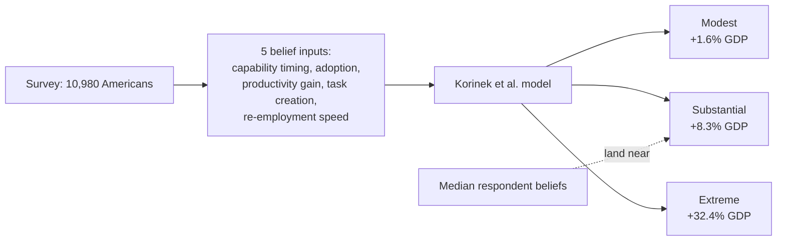

Anthropic's Economics team wants you to stop asking "how will AI affect the economy" and start asking "what do you believe about AI, and here's what that implies." That reframing, embodied in the new [Econ Scenario Explorer](https://www.anthropic.com/institute/econ-scenarios), is more intellectually honest than most AI-economics commentary — and also more fragile than the headlines built on top of it suggest.

## What was actually published

On September 9–10, Anthropic's Economics team released an interactive tool alongside a 57-page technical report, [*Economic Scenarios for Transformative AI*](https://www-cdn.anthropic.com/files/4zrzovbb/website/cf58f84d46a4a76bf5a5b039ac695fba6b80041c.pdf) (Korinek, Jones, Sacher, Cotter, and McCrory, 2026), which presents a framework for assessing the economic consequences of AI between 2026 and 2030, in which AI automates a growing share of cognitive work, raising productivity and displacing workers who must search for jobs in other occupations. The model maps three illustrative paths — modest, substantial, and extreme — onto GDP, wages, labor share, and unemployment.

The outputs are genuinely wide. In the modest case, AI's impact on the economy mirrors what the internet produced, with GDP reaching $34.1 trillion, 1.6% above the no-AI baseline, and cognitive worker wages largely stable. In the extreme case, GDP reaches $44.4 trillion, 32.4% above baseline, growing at 15.4% annually, with cognitive unemployment at 17.9% and overall unemployment at 11.9%.

## The part risk teams should actually scrutinize

Here is the detail that most coverage buried: the company backed the explorer with a companion survey of 10,980 Americans fielded with Morning Consult in August, asking five questions covering when AI will perform each of eight tasks as well as a skilled professional, how widely it will be used, how large its productivity gains will be, whether it will automate or augment work, and how long a displaced worker would take to find a new job. Feed median answers into the model, and a survey of 10,980 Americans landed near the substantial scenario; about 10 percent matched the extreme case.

That is the chain practitioners should trace carefully: the "substantial" scenario — the one nearly every outlet reported as the de facto central case — isn't derived from macroeconomic estimation, historical calibration, or a panel of economists. It's the output of lay beliefs about AI capability timing, piped through a model that is extremely sensitive to exactly that input. Change the belief, change the number. [Anton Korinek himself conceded the point](https://thenextweb.com/news/anthropic-ai-economic-scenarios-2030) when he noted that a capable AI nobody uses has no economic effect — adoption, not capability, is doing much of the work, and adoption assumptions here come straight from survey respondents, not observed behavior.

An independent researcher's reproduction effort makes the fragility concrete: attempting to rebuild the model from scratch, they found no replication package was published with the paper — the PDF carries no data or code availability statement, and the only public implementation is the minified client-side bundle behind the scenario explorer. A number this heavily cited, resting on a non-public implementation, is a governance problem before it's an economics problem.

## The economists are already fighting about the headline number

The 15.4% extreme-case growth rate triggered immediate pushback. LSE's Ben Moll and the University of Chicago's Alex Imas argued that such rates in the next 10 to 15 years are extremely unlikely, putting a more reasonable baseline at 4 to 5 percent, which they note would still be very large — and backed the view with [a public wager](https://marginalrevolution.com/marginalrevolution/2026/08/a-big-bet-on-explosive-ai-driven-growth.html) that U.S. real GDP per capita will grow by at least 15% within a single year by the end of 2033, agreed on X in August
