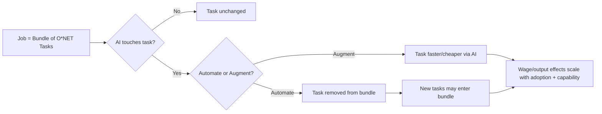

## The headline number is the least interesting part

On September 9, [Anthropic's Economics team released the Econ Scenario Explorer](https://www.anthropic.com/institute/econ-scenarios), an interactive tool projecting three paths for the US economy through 2030 — modest, substantial, and extreme — built on a companion technical report, *Economic Scenarios for Transformative AI*, and a survey of nearly 11,000 Americans. The topline range is wide: GDP ends 2030 anywhere from [1.6% above baseline in the modest case to 32.4% above baseline in the extreme case](https://ai-tldr.dev/releases/anthropic-econ-scenario-explorer/), with knowledge-worker unemployment swinging from roughly stable to [rising past recession levels while wages fall more than 10%](https://ai-tldr.dev/releases/anthropic-econ-scenario-explorer/).

Every outlet covering this led with those numbers. That's the wrong lede. The actual news is architectural: Anthropic built a model whose assumptions are exposed as sliders, not baked into a black-box forecast — and that design choice is what other labs, regulators, and enterprise risk teams will eventually have to copy, contest, or explain why they haven't.

## Tasks, not titles

The model's foundation is a task-based decomposition drawn from the Department of Labor's [O*NET taxonomy](https://www-cdn.anthropic.com/files/4zrzovbb/website/cf58f84d46a4a76bf5a5b039ac695fba6b80041c.pdf) rather than job titles. This matters because job titles are politically legible but economically crude — "nurse" obscures the fact that [AI can draft discharge instructions and monitor patients remotely, but cannot bathe a patient](https://www.anthropic.com/institute/econ-scenarios). Anthropic's own illustration makes the point explicitly: the model tracks which discrete tasks within a role get automated, augmented, or left alone, and — critically — allows for [new tasks entering the bundle as old ones leave it](https://www.anthropic.com/institute/econ-scenarios), the way remote patient monitoring didn't exist thirty years ago.

This is the same task-level lens Anthropic used in its earlier [Claude usage study](https://arxiv.org/abs/2503.04761), which mapped millions of conversations onto O*NET categories and found AI usage concentrated in software development and writing. The Econ Scenario Explorer extends that empirical instrument into a forward-looking policy tool — and inherits its central limitation. As the usage-study authors acknowledged, [reliance on O*NET's static occupational descriptions means the framework cannot account for entirely new tasks or jobs](https://www-cdn.anthropic.com/bf94fda13a76566aa55fceb3ca40cb79a50b6bcd.pdf) that don't yet exist in the taxonomy — a real constraint when the whole point of the exercise is forecasting structural change.

## Six parameters, not one number

The paper's real contribution, per its own framing, is converting a sprawling debate into [a small set of parameters — the share of tasks AI affects, how widely it's adopted, productivity gains per task, and related dials](https://www-cdn.anthropic.com/files/4zrzovbb/website/cf58f84d46a4a76bf5a5b039ac695fba6b80041c.pdf). Anton Korinek, who led the project, framed it on release as [a framework to compare possibilities](https://x.com/akorinek/status/2097687561565090189) rather than a single prediction. The paper is explicit that [the scenarios are not predictions and carry no attached probabilities](https://www.anthropic.com/institute/econ-scenarios) — their purpose is comparability, not forecasting.

That reframing is the template worth watching. Instead of "AI will add $X trillion to GDP" (the kind of number that invites either uncritical adoption or dismissal), the explorer hands you the levers and dares you to disagree with a specific parameter — how fast firms adopt, how much of a task AI can do, whether displaced workers find new roles quickly. A skeptic like Daron Acemoglu, who reviewed the draft, doesn't have to reject the whole model; he can say, as he reportedly [told NPR, that AI will keep improving but diffuse more slowly through the economy than the extreme case assumes](https://dev.to/jamilxt/anthropic-modeled-the-2030-economy-three-
