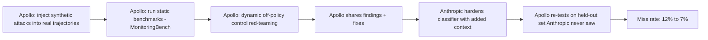

## Why this is a regulation story, not a product story

Most AI safety news concerns testing a model. This one concerns testing the thing that watches the model. [Apollo Research](https://www.apolloresearch.ai/monitoring/pilot-automode-campaign) ran a pilot red-teaming campaign against auto mode — Anthropic's classifier-based permission system that decides in real time whether a Claude Code agent's next action gets executed or blocked. That distinction matters more than it sounds: as agentic systems proliferate, the control layer — the monitor, the classifier, the guardrail — is quietly becoming as safety-critical as the model itself, and almost no one has published a reproducible method for auditing it independently. Apollo just did.

Auto mode is no longer a niche feature. It became the [general availability](https://claude.com/blog/auto-mode) default and, as of August 14, 2026, the [default permission mode](https://9to5mac.com/2026/08/14/psa-claude-code-enabling-auto-mode-as-default-next-week-anthropic-says/) for Pro, Max, and Team plans — meaning a classifier, not a human, now gates most tool calls for a large share of Claude Code's user base. That scale is exactly why the audit methodology behind it deserves scrutiny beyond the headline statistic.

## What Apollo actually did

Apollo's write-up describes three distinct testing modes, not one: failure modes at different severity levels injected into real trajectories, static monitoring benchmarks such as MonitoringBench, and dynamic off-policy control red-teaming. This triangulation is the methodologically interesting part. Anthropic worked with Apollo Research on a two-week pilot injecting synthetic attacks into real coding trajectories, across three datasets covering broad failures, data exfiltration, and safety-related threats, following a standard find-fix-verify loop.

Crucially, the verification step wasn't self-graded. Apollo re-tested the hardened classifier on a separate held-out attack set Anthropic never had access to, and auto mode caught about half of the attacks it previously missed, at a cost of missing about 2% of attacks it previously caught — since Anthropic couldn't tune against the held-out set, this suggests the hardening generalizes rather than just patching shared examples. That held-out design is the difference between a vendor-graded marketing claim and something closer to an actual audit.

The headline number followed from this loop: Anthropic ran a two-week red-teaming pilot with Apollo Research, injecting synthetic attacks into real workflows, and the hardening work dropped the classifier's miss rate on held-out attacks from 12% to 7%.

## Where the corroboration is thinner than the headline

Independent framing matters here too. Apollo describes this explicitly as groundwork for a recurring practice, noting it will start running monitor red-teaming campaigns beginning with frontier AI labs, expecting these to run asynchronously and periodically, triggered by new monitor versions shipping or by rising frontier-model risk. That's a research organization proposing to institutionalize itself as a recurring external check on monitors — a role no regulation currently mandates, but one Apollo is visibly angling to formalize before a regulator writes it into law.

It's worth separating what's audited from what isn't. The 12%-to-7% figure comes from Apollo's adversarial, synthetic held-out set — not live production traffic. Separate testing by Trajectory Labs on prompt injection, reported alongside the auto-mode rollout, is a different vendor using different methodology, and [coverage of the rollout](https://triedandtyped.com/2026/08/30/claude-code-auto-mode-default/) rightly notes Anthropic's own caveat that auto mode "does not eliminate risk." None of this is peer-reviewed in the academic sense; it's vendor-commissioned red-teaming disclosed voluntarily, which is meaningfully better than nothing but short of a mandated, standardized audit regime.

## What regulation would need to demand to replicate this

This is where the EU AI
