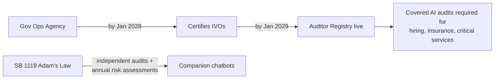

## What actually got signed

On September 9, 2026, Governor Gavin Newsom signed [Senate Bill 813 and Assembly Bill 1405](https://www.gov.ca.gov/2026/09/09/governor-newsom-signs-first-in-the-nation-ai-safeguards-to-protect-californians-calls-on-the-federal-government-to-do-its-part/), which the governor's office describes as "a first-in-the-nation framework for independent verification organizations that can assess AI systems and models for compliance with state law." The next day, Newsom signed a separate child-safety package including SB 1119, "Adam's Law," named for [Adam Raine](https://www.yahoo.com/news/politics/articles/gov-newsom-signs-adam-law-205005617.html), the 16-year-old whose death after months of conversations with a chatbot became the emotional and legislative anchor for the whole session.

The two audit bills split cleanly into supply and demand sides of a new compliance market:

- **SB 813** creates "Independent Verification Organizations" (IVOs) — an IVO is an AI auditor designated by the California Government Operations Agency after demonstrating expertise in assessing risks posed by an AI system or model.
- **AB 1405** builds the registry those IVOs and other qualifying auditors must join, and features standards for independence, transparency and integrity that match existing AI safety laws.

## The scope surprise: this isn't just a frontier-lab story

The framing that dominated early coverage — Anthropic, OpenAI, "frontier models" — undersells who is actually captured. As [TechTimes reported](https://www.techtimes.com/articles/327159/20260910/california-signs-first-us-ai-audit-law-frontier-labs-hiring-tools-now-scope.htm), any company that takes an off-the-shelf AI model and deploys it to screen job applicants, price insurance policies, or make other calls that affect people's lives is as much in scope as OpenAI or Anthropic. [ByteIota's analysis](https://byteiota.com/california-ab-1405-ai-audit-law-puts-developers-in-scope/) makes the same point more bluntly: the bill text was written to catch deployers, not just model builders.

That's the real infrastructure story: California just defined, in statute, what an independent AI auditor is — with rules on conflicts of interest, self-review, and competence borrowed almost directly from financial audit practice. As Assemblymember Bauer-Kahan told KQED, "When you have a financial institution, they have to be audited by a third-party independent source," and the bills just signed would establish an auditing scheme in California analogous to that model.

## Who wrote the rules, and who benefits from the timeline

Here's where the sourcing genuinely diverges. The Governor's office calls this "[nation-leading](https://www.gov.ca.gov/2026/09/09/governor-newsom-signs-first-in-the-nation-ai-safeguards-to-protect-californians-calls-on-the-federal-government-to-do-its-part/)" accountability infrastructure. [Gizmodo](https://gizmodo.com/newsom-signs-ai-industry-approved-ai-regulation-bills-into-law-in-california-2000809702) ran the same signing under the headline "Newsom Signs AI Industry-Approved AI Regulation Bills Into Law in California," and KQED confirmed that Anthropic endorsed SB 813 and AB 1405 in August, with the company's government affairs spokesperson praising how the bills distinguish between an AI audit — which assesses compliance controls — and an evaluation, which assesses the risks posed by an AI system itself. Both framings are accurate; they're describing the same law from opposite priors.

The timeline gives the skeptical read some teeth. [Startup Fortune](https://startupfortune.com/newsom-signs-ab-1405-creating-californias-first-ai-auditor-registry/) notes the law sets real independence standards on paper, but doesn't force a single audit to happen until 2029 — three years being a long runway in an industry that ships new frontier models every few months,
