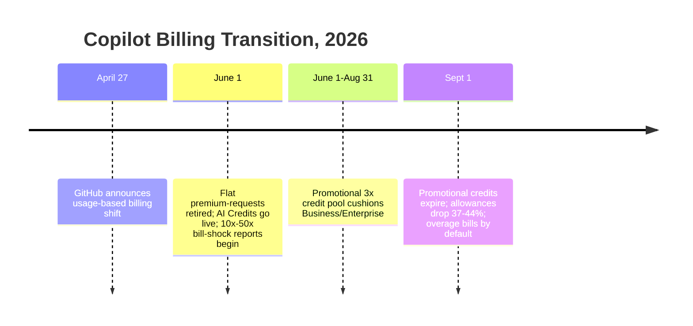

GitHub Copilot's transition off flat-rate pricing is not really a billing story. It is the clearest public dataset yet of what agentic AI costs when someone stops subsidizing the meter — and the bill is landing in three dated stages that every enterprise buying agent capacity should be tracking.

## The mechanics of the shock

On June 1, 2026, GitHub retired premium-request accounting and moved all Copilot plans to token-metered "AI Credits," where [one credit equals $0.01 and usage is calculated on actual input, output, and cached tokens](https://github.blog/news-insights/company-news/github-copilot-is-moving-to-usage-based-billing/) rather than a flat per-request count. GitHub framed this as [an important step toward "a sustainable, reliable Copilot business"](https://github.blog/news-insights/company-news/github-copilot-is-moving-to-usage-based-billing/) — corporate language for "the flat fee was never the real cost."

The backlash was immediate and well-documented. Within a day, developers were reporting that [a heavy agentic session could consume most of a monthly Pro allotment on day one](https://visualstudiomagazine.com/articles/2026/06/04/copilot-billing-shock-hits-developers.aspx), and community threads recorded users [burning 8% of a $39 Pro+ allotment in two hours](https://www.ghacks.net/2026/06/02/github-copilot-usage-based-billing-takes-effect-drawing-developer-backlash-over-rapid-credit-depletion/) or single agentic sessions consuming 16% of a monthly allowance for mediocre results. Industry coverage converged on the same headline figure: [projected cost increases of 10x to 50x for developers running agentic coding sessions](https://www.techtimes.com/articles/317536/20260601/github-copilot-pricing-change-drives-backlash-agentic-bills-jump-10x-50x-power-users.htm), with TechCrunch reporting individual Reddit projections of monthly bills [rising from roughly $29 to nearly $750](https://www.techtimes.com/articles/317536/20260601/github-copilot-pricing-change-drives-backlash-agentic-bills-jump-10x-50x-power-users.htm).

A structural detail matters more than the sticker shock: GitHub also removed the old degrade-gracefully fallback. Previously, exhausting premium requests dropped users to a lower-cost model; now, [when credits deplete, premium features simply stop until the next cycle or until additional credits are purchased](https://www.techtimes.com/articles/317536/20260601/github-copilot-pricing-change-drives-backlash-agentic-bills-jump-10x-50x-power-users.htm). That is a governance-relevant design choice — it converts a soft degradation into a hard availability cliff for any workflow built around always-on agent access.

## The September cliff is the second shock

The June backlash was actually the *cheaper* phase. To cushion the transition, GitHub temporarily tripled included allowances for Business and Enterprise customers — [3,000 and 7,000 credits per seat instead of the standard 1,900 and 3,900](https://ecorpit.com/github-copilot-promo-credits-expiry-september-bill-forecast-2026/) — with that promotional band running only through August 31, 2026. Billing documentation is explicit that [after the promotional period, included usage returns to the standard amounts](https://ecorpit.com/github-copilot-promo-credits-expiry-september-bill-forecast-2026/). That is a **36.7% cut for Business and a 44.3% cut for Enterprise seats** at identical seat price — and because [overage is enabled by default rather than opt-in](https://ecorpit.com/github-copilot-promo-credits-expiry-september-bill-forecast-2026/), teams that budgeted against the promotional pool will see their September invoices rise without any change in their actual usage.

## Why this generalizes beyond GitHub

The Copilot episode is a microcosm of a pattern already visible elsewhere. Uber's experience with Claude Code is the sharper enterprise-scale version: after rolling agentic coding out to roughly 5,000 engineers, [usage nearly doubled within months and the company burned through its entire 2026 AI budget in four months](https://portal26.ai/ai-agent-cost-control-stop-agents-burning-budget/), forcing per-engineer spend caps. The common thread across both cases is that **agentic cost scales with autonomy and iteration, not with seat count** — a single multi-step, multi-file agent session can consume more compute than
