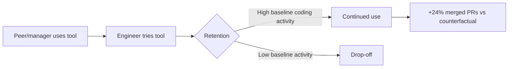

## The paper that isn't a survey

Most things practitioners are told about enterprise coding-agent ROI arrive in one of two flavors: a vendor deck citing self-selected pilot users, or a doom-laden survey headline about pilots that never scale. A [July 2026 arXiv paper](https://arxiv.org/abs/2607.01418) by Microsoft researchers Emerson Murphy-Hill, Jenna Butler, and Alexandra Savelieva breaks that pattern. It doesn't survey anyone about how productive they *feel*. It instruments the actual rollout of two agentic command-line coding tools — Anthropic's Claude Code and GitHub's Copilot CLI — across Microsoft's own engineering organization, and watches what happened to merged pull requests.

The authors are explicit about why this matters: prior developer AI adoption work typically relies on surveys and interviews, and prior impact work largely infers AI use from public-repository signals; their enterprise setting instead observes every engineer who could adopt alongside direct usage. That's a meaningfully different evidentiary standard than "84% of respondents say they feel more productive."

## What the telemetry actually shows

The study covers tens of thousands of engineers at Microsoft over its early-2026 rollout, tracking usage and PR activity across a four-month window anchored to January 5, 2026 — the boundary between the pre-period and post-period, and the point around which Microsoft's broader internal use of these tools took off. Three findings stand out:

- **Adoption is social, not administrative.** Initial use spread substantially through social channels — an engineer's peers and managers using the tool — and adopters went on to merge roughly 24% more pull requests, a gain that held steady across the four-month window. Mandates and licenses didn't drive first use; visibility into what colleagues were doing did.
- **Retention tracks work, not identity.** The paper reports first use spread primarily through social networks, retention was associated more with engineers' coding activity than with demographics. Whether someone kept using the tool had more to do with how much they already coded than with tenure, team, or career stage.
- **The output lift is real but bounded.** Adopters merged roughly 24% more pull requests than they would have otherwise, using merged PRs as a proxy for output — acknowledging that a merged PR is not the same as the value it delivers.

The authors also ran a lightweight qualitative layer: surveying attendees of Microsoft's internal "Agentic Engineering Day" two weeks after the event, with open-ended questions about how their work had changed, and from 609 responses identifying recurring themes to help interpret the quantitative findings. That's a modest addition, but it's disclosed as interpretive color, not headline evidence — a level of methodological candor rare in this genre.

## Where this lands relative to the shouting match

Line the number up against the rest of 2026's dueling claims and it sits almost exactly in the gap everyone else is arguing about.

| Source | Claimed effect | Method |
|---|---|---|
| Microsoft telemetry (this paper) | ~24% more merged PRs | Direct enterprise telemetry, counterfactual estimate |
| [DX, 2026](https://ecorpit.com/ai-coding-productivity-paradox-roi-plateau-2026/) | ~10% PR throughput rise despite 93% adoption | Telemetry, 121,000 developers |
| [Faros AI Engineering Report 2026](https://www.faros.ai/blog/are-ai-coding-assistants-really-saving) | Epics/dev up 66% | Telemetry, 22,000 developers |
| [METR RCT, 2025](https://www.faros.ai/blog/are-ai-coding-assistants-really-saving) | 19% *slower* on complex tasks | Randomized controlled trial, experienced OSS devs |
| Vendor decks (GitHub, Cursor, etc.) | 50–100%+ productivity gains | Self-selected users, controlled tasks |
| [MIT "GenAI Divide," 2025](https://www.legal.io/blog/5719519/MIT-Report-Finds-95-of-AI-Pilots-Fail-to-Deliver-ROI-
