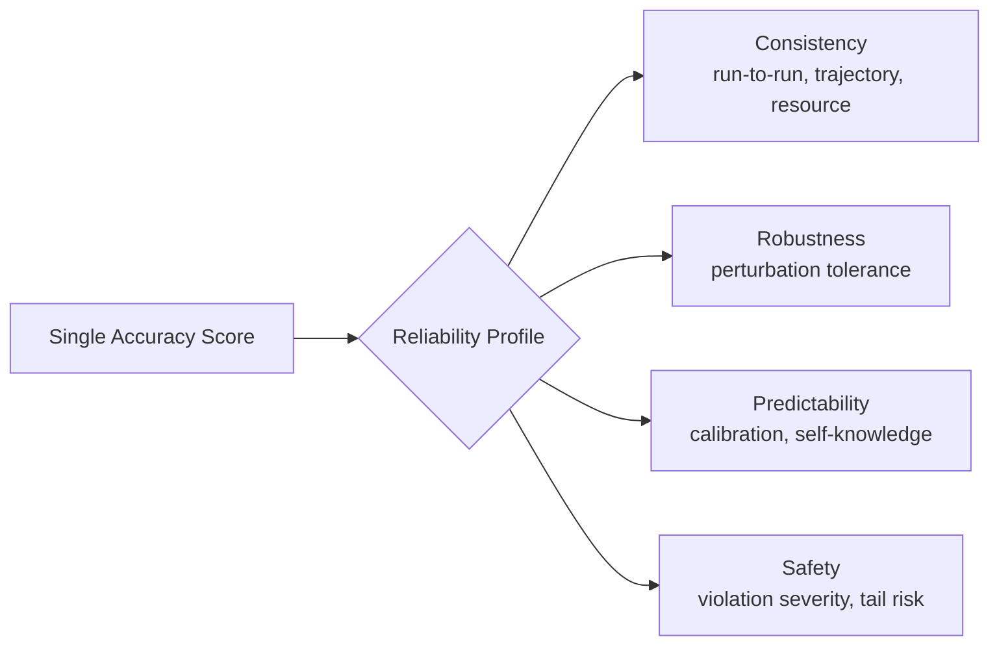

## The headline number

A new Princeton preprint puts a hard figure on something practitioners have suspected for a while: capability and trustworthiness are not the same curve. [Towards a Science of AI Agent Reliability](https://arxiv.org/abs/2602.16666), from Princeton's Stephan Rabanser, Sayash Kapoor, Peter Kirgis, Kangheng Liu, Saiteja Utpala, and Arvind Narayanan, evaluated 14 agentic models across two complementary benchmarks and found that recent capability gains have only yielded small improvements in reliability. Regressing reliability on accuracy across 24 months of frontier releases, the authors report a slope of 0.18 on GAIA and 0.33 on τ-bench — meaning a full point of benchmark accuracy buys, at best, a third of a point of reliability.

This is the empirical rebuttal the "scale solves everything" intuition has been missing. If capability and reliability moved together, the industry's default bet — that today's brittleness is a temporary artifact solved by the next model generation — would be reasonable. The data says otherwise: overall reliability shows minimal improvement over time, despite 24 months of model releases, and improving accuracy alone does not guarantee reliability gains on complex real-world tasks.

## Why one number was always the wrong number

The paper's diagnostic move is to stop compressing agent behavior into a single pass rate. While rising accuracy scores on standard benchmarks suggest rapid progress, many agents still continue to fail in practice — compressing agent behavior into a single success metric obscures critical operational flaws, ignoring whether agents behave consistently across runs, withstand perturbations, fail predictably, or have bounded error severity. Borrowing structure from aviation and nuclear engineering, the authors propose twelve concrete metrics that decompose agent reliability along four key dimensions: consistency, robustness, predictability, and safety.

Even the frontier looks shaky under this lens. [Fortune's coverage](https://fortune.com/2026/03/24/ai-agents-are-getting-more-capable-but-reliability-is-lagging-narayanan-kapoor/) reports that Claude Opus 4.5 was the most consistent in its outcomes, but its score was still only 73% consistent, while Gemini 3 Pro was poor judging when its answers were likely accurate, at just 52%, and terrible at avoiding potential catastrophic mistakes, at just 25%. And the failure isn't vendor-specific — an independent summary of the paper notes reliability appears to be an industry-wide bottleneck: all frontier model providers cluster similarly in their reliability scores, suggesting this is a fundamental limitation of current architectures rather than a vendor-specific issue.

## What "reliable enough" actually requires

The authors are explicit that this isn't a rounding error to be waited out. In their own words, quoted via [Kapoor and Narayanan's writeup](https://www.normaltech.ai/p/new-paper-towards-a-science-of-ai): for autonomous operation in high-stakes contexts, we need 3-5 "nines" of performance — 99.9% to 99.999% accuracy — in order for reliability to become a non-issue, and we don't think LLM-based agents are on track to reach such a threshold.

> Consistency and predictability — not raw task success — are what's actually gating automation, per the authors: consistency and predictability are the biggest gaps preventing models from being more reliable.

This connects directly to two threads already running on this site. The [log-analysis argument](https://minwu-ai.github.io/agent-benchmark-scores-are-lying-to-you-and-log-analysis-is-/) established that outcome-only benchmarks hide *why* agents fail; this paper shows that even when you measure *whether* they fail consistently, the answer is troubling regardless of accuracy tier. And where [the 314-page coding-agent audit](https://minwu-ai.github.io/before-you-blame-
