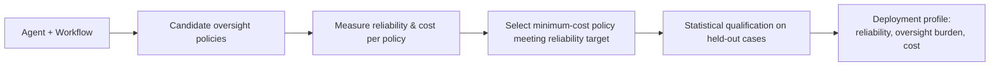

## The headline number

A new framework from Scale AI researchers makes a simple but underappreciated point: two agents can look almost identical on a benchmark and still require wildly different amounts of costly human babysitting to be safely deployed. In the [READY](https://arxiv.org/abs/2609.02095) paper, released September 2 as arXiv:2609.02095, the authors ran an end-to-end clinical-audit case study across 16 agent systems and 750 cases and found that two systems separated by only 0.3 percentage points in autonomous accuracy (72.8% vs. 72.5%) require 39.2% versus 29.6% human review, respectively, to qualify at the same 76% reliability target under the evaluated oversight policy. That's not a rounding error — it's a nearly ten-point swing in the fraction of cases a human must check, hidden entirely behind a tied leaderboard score.

That single result is the whole argument. If your procurement process ranks agents by accuracy alone, you could pick the system that costs meaningfully more to run safely, and never know it.

## What READY actually measures

The framing shift is deliberate. As the authors put it, existing AI-agent benchmarks primarily measure whether an agent can complete realistic professional work, whereas enterprise deployment requires asking a different question: whether an agent can meet a required reliability level, under an acceptable level of human oversight, and at a tolerable cost. Rather than replacing task-specific success criteria, READY preserves each workflow's own definition of successful execution while applying a common deployment-qualification procedure.

Mechanically, given an agent, a workflow, and a class of candidate oversight policies, READY measures the reliability and operating cost of the human-AI system, selects the minimum-cost policy that satisfies a specified reliability target, and statistically qualifies it on held-out cases — producing a deployment profile that characterizes the supported operating point: reliability, human-oversight burden, and cost. It's built as an open testbed that decouples workflow specification, execution, evaluation, and qualification, and runs on existing agent-evaluation infrastructure, which matters practically: it's designed to bolt onto evaluation pipelines organizations already run, not replace them.

## The blind spot this closes

This work is a direct evidence-based extension of the argument in [Agent Benchmark Scores Are Lying to You](https://minwu-ai.github.io/agent-benchmark-scores-are-lying-to-you-and-log-analysis-is-/), which drew on Princeton, UC Berkeley, UK AISI, and Apollo Research to argue outcome-only benchmarks obscure how an agent got to its answer. READY sharpens that critique with a specific economic mechanism: even when outcomes are visible and nearly tied, the *oversight regime* required to trust those outcomes at scale is invisible unless someone explicitly models it. Two 72-point-something accuracy scores can conceal a system that needs a third more human review hours — a cost line that shows up in headcount and cycle time, not in a leaderboard cell.

It also generalizes a pattern documented elsewhere: industry surveys have found [enterprise agentic systems showing roughly a 37% gap between lab benchmark scores and real-world deployment performance, with wide cost variation for similar accuracy](https://kili-technology.com/blog/ai-benchmarks-guide-the-top-evaluations-in-2026-and-why-theyre-not-enough) — READY gives that gap a rigorous, reproducible measurement procedure rather than an anecdote.

## Why this belongs in procurement, not just eval

The clinical setting is not incidental. Scale AI's broader research output — including its companion CliniCARE-Bench work — shows a team building oversight-cost tooling specifically for high-stakes, audit-heavy domains where an accuracy number was never going to be sufficient. Healthcare, finance, and legal workflows already run on human-in-the-loop review by regulatory default; READY essentially asks what that review costs for each candidate agent, and refuses to qualify one without saying so. That's a governance instrument as much as a benchmark: it forces the oversight policy into a disclosed, auditable artifact rather than an implicit assumption baked into whichever contractor happens to demo best.

The connection to the [governance gap in agentic AI](https://minwu-ai.github.io/agentic-ai-and-the-governance-gap/) is direct — model risk frameworks built to validate systems that predict struggle with systems that
