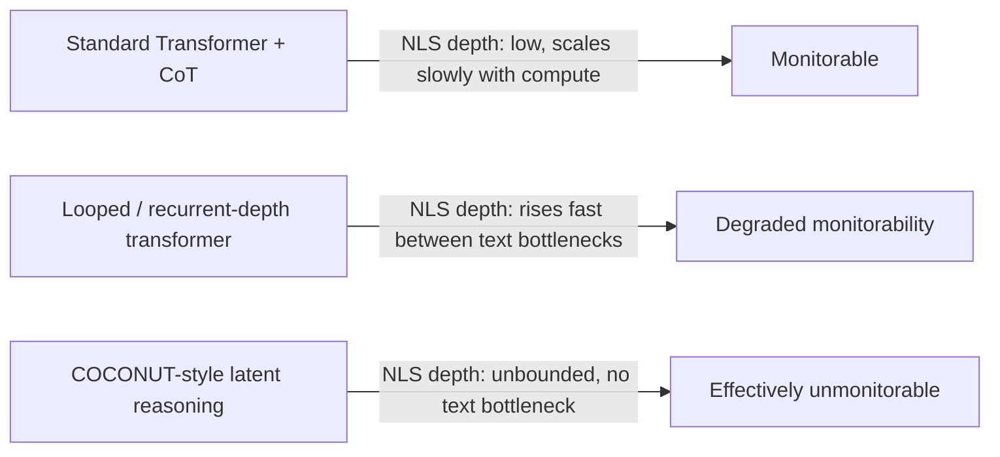

## Two documents, one week, one problem

On September 6, OpenAI chief scientist Jakub Pachocki published [an essay](https://www.unite.ai/in-an-alien-mind-openais-jakub-pachocki-urges-shared-safety-bars/) stating plainly that no AI lab has solved alignment and monitoring well enough to keep scaling at maximum speed responsibly. Four days later, Redwood Research — a Berkeley alignment nonprofit with no lab affiliation — published a technical paper that does something rarer than commentary: it gives Pachocki's warning a number.

The paper, [An Operationalization of Opaque Serial Depth](https://www.redwoodresearch.org/blog/an-operationalization-of-opaque-serial-depth), by Nathan Sheffield, Alek Westover, Lukas Finnveden, Alexa Pan, Julian Stastny, and Ryan Greenblatt, was published September 10, 2026. It defines "NLS depth" — Natural-Language-rooted node-Separated depth — as the longest chain of computation a model can carry out without passing through a step that outputs discrete, human-readable tokens. In plainer terms: how much serial thinking can a model do while never once writing something a human could read and check.

## What NLS depth actually measures

The metric extends a March 2026 theoretical paper from Google DeepMind researchers Jonah Brown-Cohen, David Lindner, and Rohin Shah, which formalized this argument through the notion of opaque serial depth, given by the length of the longest computation that can be done without the use of interpretable intermediate steps like chain of thought. That GDM paper computed upper bounds for Gemma 3 models: the 1B variant has opaque serial depth of 124, while the 27B variant has depth of 376 — proof the concept could be measured on real architectures, not just reasoned about abstractly.

Redwood's contribution is to make the definition operational and portable across architectures. Rather than relying on GDM's original criteria, NLS depth roots interpretability in two testable properties: a node counts as interpretable only if its intermediate representation is directly optimized either to imitate human-written text or to look good to humans, and there are relatively weak training incentives other than toward that natural-language prior. That's a deliberately narrow bar — it's designed to exclude architectures that superficially look like they use language while actually reasoning in some richer, unverbalizable code. The paper's authors are explicit that this closes a known loophole: rules are written to rule out turning a latent reasoning model into a model that superficially reasons in natural language via encoding and decoding its activations as natural language tokens.

Crucially, the authors are careful about what the metric is *not*. As they put it, tracking the NLS depth of AI systems is not a replacement for tracking monitorability or no-CoT capabilities; it is an important complement. NLS depth has some advantages not shared by these other measurements — in particular, NLS depth is a relatively crisp and easy-to-quantify notion, whereas it's unclear how to quantify or measure monitorability. A model could have low NLS depth and still produce misleading chain-of-thought; the metric bounds architectural *capacity* for hidden reasoning, not whether a given model is actually using CoT honestly. That distinction matters for anyone tempted to treat a published depth number as a safety certification.

## Why this lands now, not six months ago

The timing is not incidental. This same GDM framework sits at the center of a live dispute about OpenAI's GPT-6 Astra, which reportedly uses a "recurrent depth" or looped-transformer technique. Early September reporting described the model as using an architecture where a model improves its output by reprocessing the same representation multiple times internally, reasoning in a hidden latent space rather than producing visible text — and because it doesn't produce a readable trace, recurrent depth could undermine chain of thought monitoring, the main tool researchers currently use to catch a model planning harmful actions. OpenAI's Astra system card reportedly
