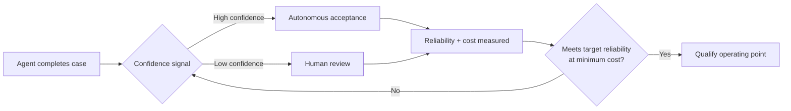

## The number that doesn't show up on any leaderboard

Two agentic systems score 72.8% and 72.5% accuracy on the same clinical-audit benchmark — a gap so small it would round to a tie on most vendor comparison sheets. Yet to hit an identical 76% reliability target, one system needs [39.2% of its cases routed to human review while the other needs only 29.6%](https://arxiv.org/pdf/2609.02095) — a nearly 10-point difference in the single most expensive line item in any AI deployment budget. That gap, buried inside a September 2026 arXiv preprint from Scale AI, UC Santa Cruz, and Vanderbilt University Medical Center researchers, is the empirical center of a new evaluation framework called READY (Reliable Enterprise Agent Deployment).

The framing is deceptively simple but genuinely reorients the buyer's question. As the paper puts it, existing benchmarks measure whether an agent can complete realistic professional work, whereas [enterprise deployment asks a different question: whether an agent can meet a required reliability level, under acceptable human oversight, and at tolerable cost](https://arxiv.org/pdf/2609.02095). READY doesn't replace accuracy scores — it sits downstream of them, converting a static leaderboard rank into a cost curve.

## How READY actually works

The mechanics are workflow-agnostic by design. Given an agent, a workflow, and a set of candidate oversight policies, [READY measures the reliability and operating cost of the human-AI system, selects the minimum-cost policy that satisfies a specified reliability target, and statistically qualifies it on held-out cases](https://arxiv.org/abs/2609.02095). Practically, that means routing each case between autonomous acceptance and human escalation using a signal — in the paper's case study, the agent's own stated confidence — and finding the cheapest routing threshold that still clears the bar.

The empirical testbed is [CliniCARE-Bench](https://arxiv.org/abs/2608.07796), a retrospective clinical-audit benchmark built from 25 clinician-authored scenarios expanded into 750 real MIMIC-IV patient cases, evaluated across 16 frontier agentic systems. That underlying benchmark is worth pausing on independently: it found that [defect-free accuracy — crediting a verdict only when correct and free of prohibited shortcuts — runs 4.8 to 14.8 points lower than raw accuracy, and reorders the leaderboard](https://arxiv.org/abs/2608.07796). READY builds its oversight-cost analysis on top of that already-more-honest accuracy layer, which is part of why its findings carry weight rather than reading as a marketing framework.

## Why this complements, not duplicates, the trace-level critique

Readers of this site's earlier piece on [agent benchmark log analysis](https://minwu-ai.github.io/agent-benchmark-scores-are-lying-to-you-and-log-analysis-is-/) will recognize the family resemblance: both projects argue outcome-only scores obscure what matters. But the two attack different layers. The log-analysis critique is about *validity* — whether the recorded score reflects what actually happened during execution. READY assumes a validity-clean accuracy number already exists and asks a distinct, downstream *economics* question: given that this agent is this good, what does it cost in human labor to make it deployment-safe? A vendor could pass every trace-level audit and still be the more expensive system to run.

## The uncomfortable part for vendors and buyers alike

Not everyone is convinced surfacing the gap solves it. One independent commentary on the CliniCARE-Bench findings argued that a [system that scores well while bypassing longitudinal-record review "will be approved for broader use faster than a system that scores lower but documents its reasoning at every decision node,"](https://www.clinicaltrialvanguard.com/clinical-bellwether/benchmarks-dont-fail-silently-agentic-ai-does/) warning that surfacing a tension and governing it in deployment are different problems. That's a fair check on scope: READY qualifies an operating point statistically, but it doesn't adjudicate whether the routing signal itself — often the agent's self-reported confidence — is trustworthy. The paper is explicit that [selective review can fail if the routing signal is poor](https://slator.com/ai-agents-human-oversight-reliability-cond/), which means READY's cost estimate is only as good as the calibration of whatever triage mechanism sits underneath it
