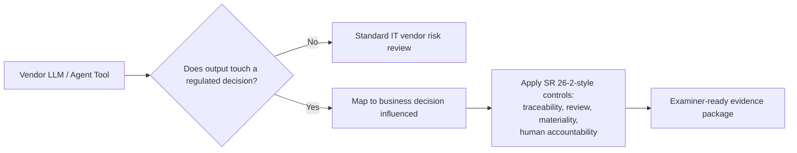

## The carve-out hiding in a footnote

When the Federal Reserve, OCC, and FDIC jointly [replaced SR 11-7 with SR 26-2](https://www.federalreserve.gov/supervisionreg/srletters/SR2602.htm) on April 17, 2026, most commentary focused on what got tightened: a narrower definition of "model," a risk-based validation cadence, and explicit proportionality by asset size. The more consequential move is a footnote. As one analysis of the guidance's scope notes, "Generative AI and agentic AI models are novel and rapidly evolving. As such, they are not within the scope of this guidance. Nonetheless, a banking organization's risk management and governance practices should guide the determination of appropriate governance and controls for any tools, processes, or systems not covered in this document."

That's a deliberate punt, not an oversight. A July 2026 [arXiv preprint](https://arxiv.org/pdf/2607.04103) proposing a "Generative AI Control Framework" (GAICF) puts it plainly: "SR 26-2 excludes generative AI and agentic AI from the formal scope because these technologies are novel and rapidly evolving." The paper's authors argue this creates a live governance problem — not a hypothetical one — because "generative AI may not directly estimate credit risk or make underwriting decisions, its outputs can materially affect the surrounding control environment through monitoring interpretation, policy analysis, or adverse-action language drafting," and these uses "may influence how regulated financial decisions are explained, challenged, documented, and governed." A model validator drafting override rationales with an LLM copilot isn't running a "model" under SR 26-2's tightened definition — but the output still lands in a regulated file.

## Why this matters more than the headline regulation

This follows directly from the site's earlier argument in [Agentic AI Has Outrun the Governance Playbook](https://minwu-ai.github.io/agentic-ai-and-the-governance-gap/): frameworks built to validate systems that *predict* strain badly against systems that *act*. SR 26-2 doesn't just strain under that pressure — it formally exits the fight. Regulators are telling the most heavily supervised sector in the U.S. economy that the primary supervisory rulebook for these tools doesn't exist yet, at precisely the moment vendors have already shipped them into production.

Trade commentary converges on the same read from different angles. One practitioner note frames it starkly: "In 2026 the AI tools arrived embedded in the systems banks already run, and the regulators rewrote model-risk guidance for the first time in fifteen years, then deliberately left generative and agentic AI out of it. The carve-out is not a reprieve." A compliance-training source makes the vendor dependency explicit: "Nearly every core banking platform, fraud monitoring system, and customer service tool on the market today embeds some form of machine learning or generative AI, usually delivered through a third-party vendor rather than built in-house."

That's the deployment-economics story regulators aren't addressing. Banks didn't build these systems in a validated model shop — they licensed them, often bundled inside a core provider's roadmap, with limited visibility into training data, update cadence, or failure modes. One analysis of the resulting exposure warns that "the coverage gap is the governance exposure that results when GenAI and agentic systems are excluded from traditional MRM controls, but no parallel framework has been established to govern them, particularly for customer-facing or decision-driving applications where output errors carry real financial or reputational risk."

## What "govern it yourself" actually requires

The GAICF preprint's contribution is translating that abstract mandate into something auditable. It proposes treating generative outputs as workflow inputs subject to control rather than as models subject to validation — mapping each use case to the regulated decision it touches, then applying traceability, review, and materiality tests borrowed from SR 26-2's own vocabulary, even though the guidance formally excludes the technology producing them.

Vendor-risk
