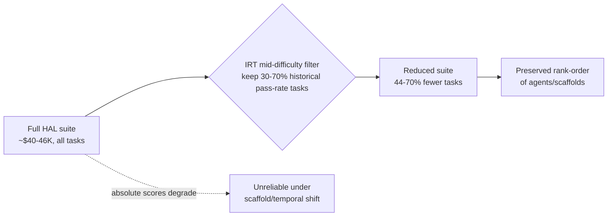

Independent verification of AI agent performance claims has quietly become something only well-capitalized organizations can afford. A March 2026 preprint offers the first credible evidence that this barrier is partly self-inflicted — and partly fixable.

## The number that started this

The [Holistic Agent Leaderboard](https://arxiv.org/abs/2510.11977) (HAL), a Princeton-led project that has become the closest thing agent evaluation has to a standard, disclosed what rigor actually costs: evaluating agents on nine benchmarks required roughly $40,000, despite considering at most two scaffolds per benchmark and only one run per scaffold–model configuration. That figure covers a single pass. Making it statistically trustworthy — running each cell multiple times to separate signal from noise — pushes the bill toward [$320,000](https://huggingface.co/blog/evaleval/eval-costs-bottleneck), according to independent analysis from the EvalEval Coalition.

Individual benchmark runs illustrate why. A single GAIA run on a frontier model can cost $2,829 before caching. Cost doesn't even track reliably with accuracy: on one HAL comparison, Browser-Use with Claude Sonnet 4 cost $1,577 for 40% accuracy, while SeeAct with GPT-5 Medium hit 42% for $171 — a near-tenfold price gap for a rounding-error difference in score.

## The paper's fix

[Efficient Benchmarking of AI Agents](https://arxiv.org/abs/2603.23749), by Franck Ndzomga — himself a co-author on the original HAL paper — starts from a simple observation about what agent benchmarks are actually used for. Most practical use cases — model selection, scaffold selection, leaderboard ranking — require only rank prediction, not precise absolute scores.

That distinction matters because agent evaluation behaves differently from static LLM benchmarking. Unlike static language model benchmarks, agent evaluation is subject to scaffold-driven distribution shift, since performance depends on the framework wrapping the underlying model. Testing across eight benchmarks, 33 agent scaffolds, and 70+ model configurations, the paper finds that absolute score prediction degrades under this shift, while rank-order prediction remains stable.

Exploiting that asymmetry, the method is almost aggressively simple: evaluate new agents only on tasks with intermediate historical pass rates (30-70%), a mid-range difficulty filter motivated by Item Response Theory that reduces the number of evaluation tasks by 44-70% while maintaining high rank fidelity under scaffold and temporal shifts. Tasks everyone already passes, or everyone already fails, carry almost no discriminating information — classic IRT logic, applied to agentic rollouts instead of multiple-choice items.

## Why this is an Industry story, not just a methods story

The paper is explicit about the stakes. It frames the cost problem in language usually reserved for compute-access debates: running comprehensive agent evaluations creates a situation reminiscent of the compute divide in Machine Learning research, and such costs create a barrier for independent researchers and small labs, and make statistically robust evaluation difficult in practice.

That framing deserves to be taken at face value. If verifying a vendor's agent performance claims costs tens of thousands of dollars, then in practice only three kinds of actors can do it: the vendors themselves, the largest labs, and well-funded platforms like HAL. Everyone else — smaller enterprise buyers doing procurement due diligence, academic labs, journalists, and most AI safety institutes outside the best-funded ones — is priced out of independent scrutiny before they ever hit a technical limit. One analysis put it starkly: academic groups, AI Safety Institutes, and journalists now hit the budget constraint before the technical one when they try to evaluate frontier agents independently, and a single GAIA run can exceed an annual graduate student travel budget.

## Where this connects — and where it doesn't
