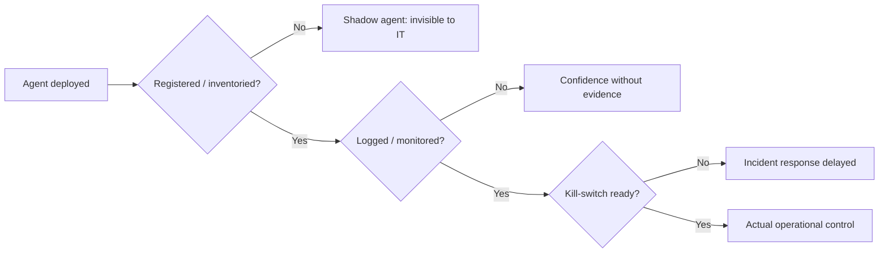

## The gap, in numbers

A new survey puts a hard number on something practitioners have suspected for a while: enterprises believe they have their AI agents under control, and the underlying infrastructure says otherwise. [Guild.ai's AI Agent Management Gap Report](https://www.guild.ai/ai-agent-management-gap-report), fielded by Morning Consult among 362 U.S. IT decision-makers and published September 22, found that 96.4% of IT decision-makers are confident their organization has a complete and accurate inventory of its AI agents. Yet 66.7% of organizations with agents experienced an agent-related operational consequence in the past 12 months.

The infrastructure numbers explain how both things can be true simultaneously. Only 42.7% have a centralized dashboard or monitoring tool, 39.8% have logging or audit trails, and just 31% can immediately stop a malfunctioning agent with an automated kill switch — though 76.5% can act within minutes when automated and manual responses are combined. In other words, most organizations are running a confidence level that their control-plane build-out doesn't yet support.

## Why this data point matters more than another benchmark

Most agentic AI coverage — including [prior analysis on this site](https://minwu-ai.github.io/agent-benchmark-scores-are-lying-to-you-and-log-analysis-is-/) of outcome-only benchmarks — concerns whether agents perform tasks correctly. This survey asks a different, arguably more consequential question: do enterprises even know what agents they're running, and can they stop one? That's an operations question, not a capability question, and it's been harder to quantify because it requires surveying deployers rather than testing models.

The scale context makes the gap sharper. Guild's report notes 96% of organizations report having AI agents in production, and 47% of organizations with agents are running dozens or more. Deployment has outrun the tooling meant to track it — a pattern the report itself frames directly: Policy is ahead of practice. 96% of enterprises run agents in production. No function owns them. Only four in ten log what those agents actually do.

## Cross-referencing the pattern

This isn't an isolated finding. Multiple independent surveys converge on the same confidence/control mismatch, even when the specific numbers differ:

| Survey | Confidence claim | Reality check |
|---|---|---|
| Guild.ai/Morning Consult (Sept 2026) | 96.4% confident inventory is complete | 66.7% had an incident; 31% can kill-switch instantly |
| [Okta](https://www.csoonline.com/article/4205348/why-you-need-a-reliable-ai-agent-kill-switch.html) (cybersecurity execs, July 2026) | — | only 47% are confident they can identify all AI agents in their environment, only 46% centrally control what those agents can access |
| [CSA/Token Security](https://cloudsecurityalliance.org/blog/2026/04/28/the-shadow-ai-agent-problem-in-enterprise-environments) (April 2026) | 68% report high visibility | 65% had an AI agent security incident in the past year... 82% discovered at least one AI agent or workflow that security or IT did not previously know about |
| Beam.ai / industry analysis | 82% confident policies protect them | over half of deployed agents operate without security oversight or logging. Only 21% of executives have complete visibility |

The consistency across differently-worded, differently-sampled surveys is itself the finding: this is not one vendor's marketing number, it's a structural pattern.

## The decommissioning blind spot

A related survey on kill-switch readiness in chip-design environments adds a sharper edge: decommissioning ranks last among the controls leaders plan to add before they scale, and fewer than half are very confident they can reliably disable an agent. Notably, expectation of a claw-back rises with fleet size... The organizations with the most agents in production are the most certain they will have to pull some of them back, which suggests the expectation comes from operating experience — meaning the people closest to the problem trust their own kill switches the least.

## What to watch

This connects directly to the structural argument made in [
