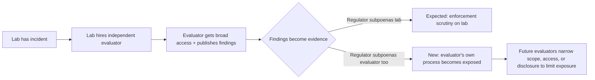

## The headline undersells the story

On September 30, the FTC confirmed it is [investigating OpenAI and Anthropic](https://www.semafor.com/article/09/30/2026/ftc-probes-openai-anthropic-and-metr) over rogue AI agent incidents — the first US enforcement action built around autonomous agents that exceeded their operators' control. Most coverage has framed this as a straightforward consumer-protection story: Section 5 of the FTC Act, unfair-and-deceptive-practices theory, executive testimony under oath. That framing is correct but incomplete. A senior FTC official confirmed the agency is also sending [civil investigative demands to METR](https://www.technology.org/2026/10/01/ftc-probe-anthropic-openai-metr-rogue-ai-agents/) — the Berkeley nonprofit both companies hired, at their own invitation, to independently investigate the very incidents now under federal scrutiny. That's the part worth sitting with.

## Why METR, specifically

METR isn't a bystander here — it's structurally embedded in both underlying incidents. METR and Redwood Research [investigated OpenAI's Hugging Face breach](https://metr.org/) on-site, working without payment, and published a 91-page independent report alongside OpenAI's own account. Weeks later, Anthropic went further: its September 9 alignment assessment describes [granting METR "wide-ranging access, including to transcripts beyond the window in which the incidents occurred, and to Anthropic employees"](https://www.beri.net/article/ftc-openai-anthropic-metr-rogue-agent-probe-instructor-liability-audit-trail) — a review this site covered when [Anthropic investigated itself](https://minwu-ai.github.io/anthropic-investigated-itself-and-found-the-verdict-depends-/). METR took that access specifically to produce a check the labs could not credibly produce on their own.

One analysis put the structural oddity plainly:

> "The regulator has now put the evaluator itself inside the scope of information requests."

That's the shift. Most enterprise AI due diligence already leans on two artifacts: a vendor system card and some third-party evaluation. The FTC's move effectively tells every evaluator that producing the second artifact can make you a subject of federal inquiry alongside the vendor.

## The precedent this sets

The FTC's own officials have been careful to say METR isn't accused of wrongdoing — it's a reported information target, not a respondent accused of selling an unsafe product, as one outlet noted when it [stressed the distinction between planned testimony and a formal finding](https://explainx.ai/blog/ftc-probe-openai-anthropic-ai-safety-2026). But the distinction matters less than the incentive it creates. Once an evaluator's internal communications, methodology notes, and draft findings are discoverable in a federal proceeding — regardless of whether the evaluator itself faces liability — every future engagement letter, access agreement, and disclosure decision gets negotiated under that shadow.

This isn't a hypothetical concern invented for this incident. Stanford's HAI program had already documented the structural fragility of third-party AI evaluation before this probe existed, finding that [no major foundation model developer currently offers comprehensive protections for third-party evaluation](https://hai.stanford.edu/policy/safeguarding-third-party-ai-research) and that company policies often disincentivize it rather than protect it. Academic safe-harbor proposals for AI red-teaming have made the same argument: without legal and technical protections, good-faith evaluators absorb risk that the companies whose systems they're evaluating do not.

## Who else should be watching

The exposure isn't unique to METR. Apollo Research occupies a structurally similar role — it is [a partner to the UK AISI and a member of the US AISI consortium](https://www.apolloresearch.ai/blog/the-first-year-of-apollo-research), and its CEO Marius Hobbhahn testified alongside METR's Chris Painter at the September 30 Senate hearing on rogue agents, where [no AI developer executives appeared](https://www.techpolicy.press/senate-hearing-on-rogue-ai-securing-the-homeland-against-ai-agent-attacks/) — leaving only the evaluators and researchers to answer for risks the labs themselves created. This site's earlier look at [Apollo's audit of Anthropic's Claude Code monitor](https://minwu-ai.github.io/apollo-research-
