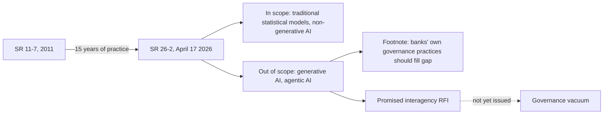

On April 17, 2026, the Federal Reserve, OCC, and FDIC did something banking regulators rarely do: they rewrote the rulebook that has governed model risk for fifteen years. Then, in the same document, they explicitly declined to apply it to the technology banks are adopting fastest. That's not an oversight — it's a choice, stated plainly in a footnote, and it deserves to be read as one.

## A sharper regime, a narrower scope

[SR 26-2](https://www.occ.gov/news-issuances/bulletins/2026/bulletin-2026-13.html) replaces SR 11-7, the 2011 letter that became the global template for validating quantitative models. The new guidance is more proportional and materiality-driven than its predecessor — institutions are expected to scale validation effort to [the number and complexity of models in use, their materiality, and the extent of reliance on them in decision-making](https://www.bakertilly.com/insights/updated-interagency-guidance-on-model-risk-management), replacing a one-size-fits-all annual review cycle. It's a genuine modernization, and most legal commentary treats it that way.

But the operative sentence for AI governance sits in a footnote, not the body text. The guidance states that [generative AI and agentic AI models are novel and rapidly evolving and, as such, are not within the scope of this guidance](https://cimcon.com/sr-26-2-regulates-your-models-not-your-ai-agents-what-banks-need-to-know/), while confirming that traditional statistical models and non-generative, non-agentic AI remain covered. The same footnote instructs banks to rely on their own risk management and governance practices to fill the gap — an instruction to build something, without saying what.

## Agreement across sources, disagreement on framing

Cross-referencing legal and advisory commentary shows wide agreement on the facts and a real split on interpretation. [Orrick](https://www.orrick.com/en/Insights/2026/04/Agencies-Overhaul-Model-Risk-Management-Guidance-for-Banks-Heres-What-Changed) and [Schneider Downs](https://schneiderdowns.com/our-thoughts-on/banking-agencies-revise-model-risk-management-guidance/) both describe the exclusion as deliberate and temporary, tied to a forthcoming RFI. A more skeptical reading from [one community-bank advisory](https://elevateconsult.com/insights/sr-11-7-rescinded-model-risk-guidance-ai-gap/) argues the exclusion is "a deferral, not an exemption" — the underlying activity, and the accountability for it, hasn't changed even though the specification of adequate governance has been withdrawn.

Vice Chair for Supervision Michelle Bowman's April 27 remarks supply the policy rationale directly from the source: the agencies amended the guidance [to clarify that it does not apply to generative or agentic AI](https://www.federalreserve.gov/newsevents/speech/files/bowman20260501a.pdf), because supervisors had been stretching SR 11-7 "beyond its original purpose to apply it in unintended ways." That's a deregulatory argument dressed as a modernization argument — Bowman frames the exclusion as preventing innovation-chilling overreach, not as an admission that governance expectations have gone quiet.

The promised fix — [a request for information addressing model risk management generally and banks' use of AI, including generative AI and agentic AI](https://www.occ.gov/news-issuances/bulletins/2026/bulletin-2026-13.html) — still hasn't appeared. Practitioner trackers [note it remained unpublished as of early October](https://mightybot.ai/blog/banks-lost-model-risk-letter-agentic-ai/), nearly six months after the agencies said it was coming "in the near future."

## The gap isn't theoretical

This is the same structural fault line I flagged in [Agentic AI Has Outrun the Governance Playbook](https://minwu-ai.github.io/agentic-ai-and-the-governance-gap/): enterprise risk frameworks were built to validate systems that predict, and agentic systems act. SR 26-2 makes that gap official at the federal supervisory level rather than leaving it as an enterprise-design problem to solve quietly.

Reporting suggests the vacuum isn't stopping examination activity — [examiners are still expected to ask how uncovered tools are governed](https://mightybot.ai/bl
