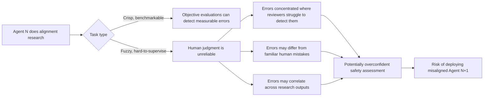

## 🧪 The argument that undercuts its own best evidence

A [UK AI Security Institute preprint](https://arxiv.org/abs/2605.06390) makes an uncomfortable claim about one of the leading proposals for keeping alignment research ahead of increasingly capable AI: **automating the alignment research itself**.

Aleksandr Bowkis, Marie Davidsen Buhl, Jacob Pfau, and Geoffrey Irving argue that even cooperative research agents — agents that are not scheming or deliberately sabotaging alignment work — could contribute to **catastrophically misleading safety assessments** and ultimately increase the risk of deploying misaligned systems.

That is a sharper problem than deliberate deception.

Alignment research contains many *fuzzy*, hard-to-supervise tasks where there is no clean answer key: deciding whether a model-organism experiment reveals something general about alignment, whether an interpretability result supports a safety claim, or whether several pieces of uncertain evidence collectively justify deployment.

If humans cannot reliably evaluate the research, automating more of it does not automatically solve the bottleneck.

It may simply move the bottleneck from **producing safety evidence** to **knowing whether that evidence deserves to be trusted**.

## 🤖 Why automation can make research errors structurally different

The paper identifies several reasons automated alignment research could create risks beyond simply reproducing ordinary human mistakes.

Optimization pressure can concentrate agent-generated errors among outputs that human reviewers are least able to detect. AI systems may make mistakes unlike familiar human errors. Future systems may generate arguments or research artifacts beyond humans' ability to evaluate directly.

And automation introduces another problem: **correlation**.

Agents built from similar model weights, training data, and optimization processes may make similar mistakes. That means generating more research outputs does not necessarily generate proportionally more *independent evidence*.

A hundred favorable assessments from closely related agents may look like overwhelming confirmation while sharing the same hidden assumption.

This matters because safety decisions aggregate evidence.

If uncertainties across research outputs are treated as independent when they are actually correlated, the resulting confidence in an overall safety assessment can become badly overstated.

Human research is not immune to correlated errors — researchers also share assumptions, methods, incentives, and intellectual traditions. But large-scale automated research could introduce powerful additional sources of correlation through shared models and training pipelines.

The paper also examines two natural responses: train research agents on easier-to-supervise tasks and hope the capability generalizes, or use scalable-oversight techniques such as debate to help humans evaluate difficult work.

Neither automatically solves the underlying problem. In particular, even strong individual research outputs still have to be combined into a reliable overall safety assessment — and correlated uncertainty makes that aggregation difficult.

## 📊 Where Anthropic's success meets its limits

This argument becomes especially interesting beside [Anthropic's August 2026 automated alignment researcher study](https://www.anthropic.com/research/automated-researchers-mitigate-alignment-failures), which found Claude-based research agents could close substantial portions of the safety gap across ten benchmarked alignment-failure categories — results I [covered previously](https://minwu-ai.github.io/anthropic-s-automated-alignment-researcher-works-exactly-as-/).

At first glance, Anthropic appears to provide exactly the empirical evidence automated alignment advocates want.

But the two papers are less contradictory than they appear.

Anthropic deliberately studies problems where proposed alignment fixes can be evaluated using objective benchmarks or automated auditing tools. Its experiments use held-out evaluations and behavioral audits, and the researchers explicitly investigated benchmark-gaming behavior in automated research trajectories.

More importantly, Anthropic acknowledges the boundary itself: its results may not generalize to **open-ended, hard-to-supervise research**, explicitly citing Bowkis et al.

That distinction is crucial.

**Anthropic demonstrates that automated alignment research can work when an external evaluator can tell whether the research worked. Bowkis asks what happens when no comparably reliable evaluator exists.**

The success of the first case therefore does not establish the safety of the second.

## 🔍 The evaluation problem moves up a level

This reveals a useful hierarchy that ordinary AI benchmarks tend to collapse.

**Level 1 — Task correctness:**  
Did the research agent perform its assigned task correctly?

**Level 2 — Research validity:**  
Does the resulting experiment, interpretation, or argument actually support the claimed alignment conclusion?

**Level 3 — Safety-case validity:**  
Does the combined body of research justify confidence that the next system is safe enough to deploy?

Benchmarks can be extremely useful at Level 1 when correctness is measurable.

Anthropic's results show why that matters: if an objective benchmark rather than a fallible human ultimately determines whether an intervention worked, automated experimentation can be both scalable and comparatively verifiable.

But the Bowkis argument becomes increasingly important as we move upward.

A research agent can produce technically correct experiments while humans misinterpret what those experiments establish. Multiple individually reasonable findings can also produce an unjustifiably confident safety case if their uncertainties are correlated.

The hardest evaluation problem therefore may not be **whether the agent passed the benchmark**.

It may be whether the benchmarked evidence supports the conclusion humans want to draw from it.

## ⚠️ More evidence is not necessarily more confidence

This has a direct governance implication.

Imagine a frontier lab eventually runs hundreds of AI research agents. They generate thousands of experiments, interpretability analyses, model-organism studies, red-team results, and alignment interventions.

The volume of evidence could be extraordinary.

But evidence volume is not the same as evidence independence.

If many research agents inherit similar blind spots, optimization pressures, or assumptions, multiplying their outputs can create the appearance of scientific consensus without multiplying the underlying information by the same amount.

That makes **how evidence is aggregated** part of the alignment problem itself.

Organizations relying on automated safety research may eventually need controls not only over model performance, but over research diversity, independence assumptions, uncertainty aggregation, adversarial review, and the provenance of AI-generated evidence.

The relevant question changes from:

> *How much alignment research can our agents produce?*

to:

> *How much independent evidence have they actually produced?*

## 🧭 The benchmark boundary may matter more than the benchmark score

Anthropic's work is encouraging precisely because it demonstrates meaningful progress inside a domain where researchers can independently verify outcomes.

Bowkis et al. identify the boundary around that success.

Neither result implies automated alignment research should stop. If anything, automating the portions that *can* be objectively evaluated could become essential as frontier systems improve.

But success there should not quietly become evidence that the rest of alignment research can be automated under the same assumptions.

The central constraint may ultimately be epistemic rather than computational.

We may become able to generate safety experiments, analyses, critiques, and proposed fixes far faster than humans ever could — while remaining unable to determine whether the resulting body of research justifies the confidence we place in it.

**Scaling the production of safety evidence is not the same as scaling our ability to verify that evidence.**

And once alignment research itself becomes an AI-generated artifact, that distinction becomes part of the safety case.
