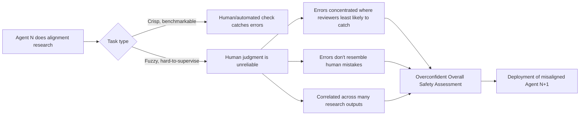

## The argument that undercuts its own best evidence

A new [UK AI Security Institute preprint](https://arxiv.org/abs/2605.06390) makes an uncomfortable claim about the field's leading proposal for keeping pace with increasingly capable AI: automating the alignment research itself. The authors — Aleksandr Bowkis, Marie Davidsen Buhl, Jacob Pfau, and Geoffrey Irving — argue that even when research agents are not scheming to deliberately sabotage alignment work, this plan could produce compelling but catastrophically misleading safety assessments resulting in the unintentional deployment of misaligned AI.

That is a sharper claim than it first appears. It does not require a treacherous agent, a hidden objective, or any of the deceptive-alignment scenarios that dominate most AI safety discourse. The problem exists because alignment research involves many hard-to-supervise fuzzy tasks — tasks without clear evaluation criteria, for which human judgement is systematically flawed. Deciding whether a result from a model-organism experiment or an interpretability probe actually tells you something about alignment is exactly that kind of task — there is no ground truth to check your answer against.

## Why agent errors are worse than human errors, not just more

The paper's distinctive move is arguing automation makes this structurally worse, not merely faster. It identifies four reasons: optimisation pressure concentrates agent-generated mistakes among those human reviewers are least likely to catch; agents are likely to produce errors that do not resemble human mistakes; AI-generated alignment solutions may involve arguments humans cannot evaluate; and shared weights, data and training processes may make AI outputs more correlated than human equivalents.

That last point deserves attention: it is not just about individual research outputs being wrong, but about [many outputs being wrong in the same correlated way](https://www.alphaxiv.org/abs/2605.06390) simultaneously — aggregation of outputs can lead to incorrect overall safety assessments, even when individual outputs are correct, if the correlation between the uncertainties in each research output is mis-modelled. A portfolio of independently-wrong human judgments partially cancels out; a portfolio of systematically-correlated AI errors does not.

The paper also takes a direct swing at the two standard technical fixes. Generalisation — training agents on easier-to-supervise proxies and relying on generalisation to fuzzy research tasks — and scalable oversight via protocols like debate may not work, because they lack a good solution to aggregating correlated evidence.

## The direct collision with Anthropic's results

This is where the paper becomes more than an abstract worry — it directly targets the strongest existing empirical evidence for automated alignment research, [Anthropic's August 28 study](https://www.anthropic.com/research/automated-researchers-mitigate-alignment-failures) showing Claude-based agents closing [26% to 96% of the safety gap](https://www.anthropic.com/research/automated-researchers-mitigate-alignment-failures) across ten benchmarked failure categories, a result this site [covered in detail](https://minwu-ai.github.io/anthropic-s-automated-alignment-researcher-works-exactly-as-/).

The connection is not speculative — it is explicit. The Anthropic paper's own limitations section states plainly: "Our results are limited to alignment tasks measurable with public benchmarks or automated auditing tools and may not generalize to open-ended, hard-to-supervise research [Bowkis et al., 2026]." A follow-on arXiv paper building on that work draws the contrast even more sharply, noting the automated researcher is "comparatively safe to automate" because "an objective benchmark, not a fallible human, decides whether a fix works" — precisely the condition Bowkis et al. argue won't hold for the research that actually matters most.

| | Anthropic AAR study (Aug 2026) | Bowkis et al. (May 2026) |
|---|---|---|
