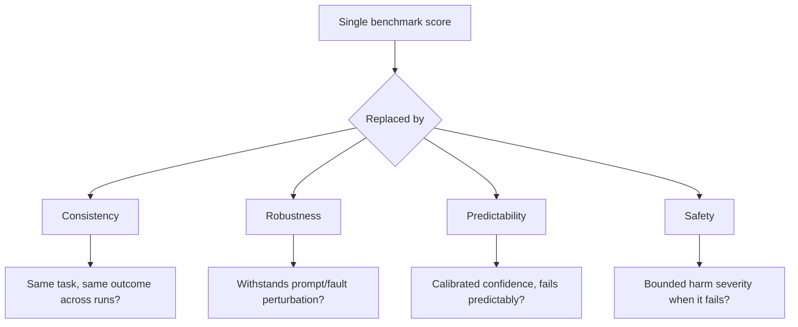

## The headline finding, stated plainly

A new Princeton preprint puts a number on something procurement teams have felt but couldn't quite name: capability and reliability are different axes, and vendors have been improving on only one of them. In [Towards a Science of AI Agent Reliability](https://arxiv.org/abs/2602.16666), researchers Stephan Rabanser, Sayash Kapoor, Peter Kirgis, Kangheng Liu, Saiteja Utpala, and Arvind Narayanan report that reliability gains lag behind accuracy improvements, with overall reliability showing minimal improvement over time despite 24 months of model releases, while improving accuracy alone does not guarantee reliability gains on complex real-world tasks. Testing frontier models across two complementary benchmarks, they found that evaluating 14 models on two complementary benchmarks, nearly two years of rapid capability progress produced only modest reliability gains.

That is the sentence procurement should paste into every vendor RFP.

## Why one number was always going to mislead you

The paper's diagnostic move is to reject the premise that agent quality is a scalar. While rising accuracy scores on standard benchmarks suggest rapid progress, many agents still continue to fail in practice — a discrepancy that highlights a fundamental limitation of current evaluations, since compressing agent behavior into a single success metric obscures critical operational flaws, notably whether agents behave consistently across runs, withstand perturbations, fail predictably, or have bounded error severity. Drawing an explicit analogy to safety-critical engineering, the authors note that safety-critical engineering fields — aviation, nuclear, automotive — figured out decades ago that reliability is not the same as average performance, and independently converged on four dimensions: consistency, robustness, predictability, and safety.

The resulting framework decomposes those four dimensions into twelve measurable metrics, evaluated across 15 agents across 2 benchmarks on twelve metrics spanning four reliability dimensions (the arXiv abstract cites 14 models; the published ICML/dashboard version reports 15 — a minor revision detail, not a substantive discrepancy).

## The counterintuitive findings buyers should actually worry about

Three results from the [dashboard](https://hal.cs.princeton.edu/reliability/) cut against procurement intuition:

- **Robustness ceiling, prompt fragility.** Fault robustness and structural robustness show ceiling effects across most models, but prompt robustness remains a key differentiator — sensitivity to superficial instruction paraphrasing varies substantially, a counterintuitive pattern since models tolerate real infrastructure faults but remain vulnerable to surface-level variations in how tasks are specified. Vendor demos rarely stress-test phrasing variance; production traffic is nothing but phrasing variance.
- **Bigger isn't more consistent.** While calibration, robustness, and safety generally improve with model size, consistency often exhibits an inverse pattern: smaller models frequently achieve equal or higher consistency than their larger counterparts. A vendor pitching "our newest flagship model" as the reliability upgrade may be selling exactly the wrong axis.
- **This is an industry-wide plateau, not a laggard problem.** All frontier model providers cluster similarly, indicating reliability is an industry-wide plateau rather than a vendor-specific limitation. No amount of vendor shopping alone solves this; it has to be designed around at the integration layer.

The rewirenow.com analysis of the paper crystallizes the procurement implication well: the value of an agent depends heavily on how much supervision it requires, and larger gains appear to lie in work that can run with limited oversight — a system is usually granted that degree of autonomy only once its behaviour is consistent enough to be trusted over time. An agent that completes a task correctly nine times out of ten but fails unpredictably in the tenth case may still require review of all ten — which is precisely
