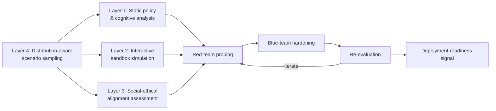

## The Problem Underneath the Problem

Most agent evaluation debates argue about how to test agents. A [March 2026 preprint](https://arxiv.org/abs/2603.14987) from researchers at the Chinese University of Hong Kong, Macao Polytechnic University, and Jilin University argues the more basic failure is that nobody has agreed on what "trustworthy" measurably means before testing begins. The paper's framing is blunt: current evaluation practices remain fragmented, measuring isolated capabilities such as coding, hallucination, jailbreak resistance, or tool use in narrowly defined settings, and the central limitation is not merely insufficient coverage of evaluation dimensions, but the lack of a principled notion of representativeness. The authors call today's leaderboards "benchmark islands" — disconnected scores that don't compose into a picture of how an agent behaves in the world.

This is the upstream half of a problem this site has [covered before](https://minwu-ai.github.io/agent-benchmark-scores-are-lying-to-you-and-log-analysis-is-/): outcome-only scores hide how an agent got its answer. That earlier paper fixed the *measurement instrument* — log-level trace analysis instead of pass/fail outcomes. This one attacks something further upstream: the *target*. You can analyze logs perfectly and still not know what "safe enough" means if trustworthiness itself isn't defined.

## Five Properties, One Manifold

The paper's answer is the Holographic Agent Assessment Framework (HAAF). It defines agentic trustworthiness as a five-property profile—Reliability, Robustness, Safety, Social-Ethical Alignment, and Operational Integrity—grounded in current AI risk frameworks, then characterizes agent trustworthiness over a scenario manifold spanning task types, tool interfaces, interaction dynamics, social contexts, and risk levels rather than isolated benchmark tasks.

The rationale for the sampling engine is explicitly about tail risk: this problem is particularly severe for low-frequency but high-consequence events, including adversarial manipulations, cascading tool failures, and socially sensitive interactions, which are often absent from standard evaluation suites despite being central to trustworthy deployment. That's the correct diagnosis of why scalar leaderboards mislead: a single average score can look excellent while masking a catastrophic failure mode that occurs in 2% of a heavy-tailed scenario space.

## The Headline Claim — and Its Asterisk

The paper's most attention-grabbing result is a cross-family transfer experiment: interventions designed from a single focal model generalise -- without per-model or per-scenario tuning -- to 13 systems from seven model families (Llama, Mistral, Kimi, GLM, Qwen, GPT, DeepSeek) on a 100-scenario suite, where all 13 systems improve and two reach a perfect risk-weighted profile. That is a different, more useful claim than the usual "our fix improves our model." It's a claim about whether agent-safety interventions are *properties of good design principles* rather than *narrow patches for one model's quirks* — closer in spirit to how a firmware patch is expected to work across hardware revisions than to how a jailbreak defense is usually built and tested.

It's worth flagging, though, that an independent review of the paper raises a real methodological caveat: the transfer test and the intervention design draw on the same 100-scenario suite, which undercuts the no-tuning claim to some degree — the interventions weren't tested on a genuinely held-out scenario distribution, only on held-out *models*. That doesn't invalidate the cross-model result, but it does mean the "generalizes to anything" framing should be read more narrowly as "generalizes across model families on this scenario distribution."

| What transfers | What's untested |
|---|---|
| Interventions across 13 systems, 7
