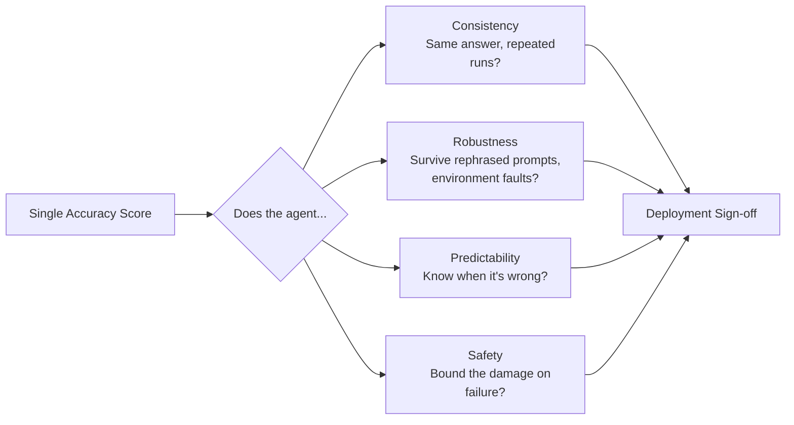

## The headline number

A model can get smarter for two years and barely get more dependable. That is the uncomfortable finding in [Towards a Science of AI Agent Reliability](https://arxiv.org/abs/2602.16666), a Princeton preprint from Stephan Rabanser, Sayash Kapoor, Peter Kirgis, Kangheng Liu, Saiteja Utpala, and Arvind Narayanan, now accepted at [ICML 2026](https://icml.cc/virtual/2026/poster/66364). Testing 14–15 frontier models spanning roughly two years of releases on GAIA and τ-bench, the authors report that recent capability gains have only yielded small improvements in reliability, even as rising accuracy scores on standard benchmarks suggest rapid progress, while many agents still continue to fail in practice. Their own figure puts numbers on the divergence: accuracy climbs at roughly 0.21/year while composite reliability moves at closer to 0.03–0.10/year depending on the benchmark — reliability gains lag behind capability progress, and the relationship between the two varies across benchmarks, indicating that accuracy gains do not automatically yield reliability.

This is the second Princeton-adjacent paper this site has covered from an overlapping author group. The [earlier piece on log analysis](https://minwu-ai.github.io/agent-benchmark-scores-are-lying-to-you-and-log-analysis-is-/) argued benchmark scores themselves are often invalid measurements. This paper takes a different tack: assume the benchmark score is roughly right, and ask whether "roughly right on average" is even the property that matters for a deployment decision.

## Four dimensions accuracy can't see

Borrowing from aviation and nuclear safety engineering, the authors decompose reliability into four dimensions and twelve metrics that are independent of raw accuracy: consistency (outcome, trajectory, resource), robustness (fault, environment, prompt), predictability (calibration, discrimination, Brier score), and safety (compliance, harm severity).

The results by dimension diverge sharply. On consistency, the team found agents that can solve a task often fail on repeated attempts under identical conditions, with outcome consistency scores ranging from 30% to 75%. On robustness, most models handle genuine technical failures like server crashes and API timeouts gracefully, but performance drops substantially when instructions are rephrased with the same semantic meaning — a brittleness that has nothing to do with the model's raw skill. Predictability fared worst: agents are not good at knowing when they're wrong — the weakest dimension across the board — and when they report confidence, it often carries little signal, with most models unable to distinguish correct from incorrect predictions better than chance on one benchmark. The one bright spot, per a later abstract of the paper, is that predictability showed some improvement in later model generations, even as it remains the weakest link overall.

## Why this matters for sign-off, not just science

Here is the deployment-economics problem the paper hands to risk teams directly, in its own Impact Statement: reliability metrics can inform deployment decisions and provide concrete criteria for determining whether an agent is suitable for a given deployment context — for example, an organization deploying a customer-service agent could require minimum thresholds on consistency and predictability before moving from a sandboxed pilot to production, while a code-generation agent might face stricter safety requirements around destructive operations.

That reframes "reliable enough to deploy" as a *task-conditional threshold problem*, not a leaderboard-rank problem. A code agent with 92% accuracy but 40% outcome-consistency isn't 92%-reliable for a CI/CD pipeline — it's a coin flip on whether last Tuesday's passing run repeats today. This connects directly to what the [314-page coding-agent audit](https://minwu-ai.github.io/before-you-blame
