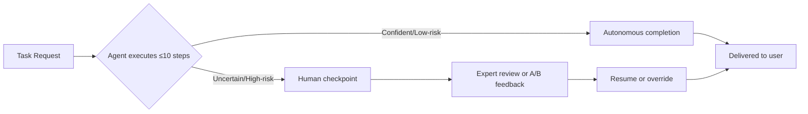

## The data behind the hype

For two years, the agentic AI narrative has been written by lab demos and benchmark leaderboards: long-horizon autonomy, minimal human oversight, models fine-tuned toward specialized capability. A new paper suggests almost none of that describes what's actually running in production.

["Measuring Agents in Production" (MAP)](https://arxiv.org/abs/2512.04123), posted to arXiv in December 2025 by a 25-author team spanning UC Berkeley, Stanford, and Databricks — including Dawn Song, Ion Stoica, and Matei Zaharia — is, by its own description, the first systematic study of AI agents in production using first-hand data from agent developers, conducted through 20 case studies via in-depth interviews and a survey of 306 practitioners across 26 domains. It has since been [accepted at ICML 2026 as an oral presentation](https://arxiv.org/list/cs.SE/2025-12?skip=350&show=25), a signal of how seriously the research community is treating it.

The paper's central finding is a direct challenge to the dominant vendor and lab framing: production agents are built using simple, controllable approaches — 68% execute at most 10 steps before human intervention, 70% rely on prompting off-the-shelf models instead of weight tuning, and 74% depend primarily on human evaluation.

## What "controllable by design" actually looks like

The researchers didn't just count steps. They asked why teams build this way, and the answer is not immaturity — it's a deliberate engineering tradeoff. Practitioners achieve reliability through best practices in system-level design rather than model-level or algorithmic advances; despite the popularity of RL in research and its benchmark gains, practitioners default to prompting closed-source models because this approach is more robust to model upgrades and more sample-efficient. In other words: fine-tuning locks you to a model checkpoint; prompting lets you swap in the next frontier release without retraining.

Custom orchestration reinforces the pattern. Analysis from [Lovelytics](https://lovelytics.com/post/how-lovelytics-databricks-solve-the-agent-reliability-paradox/), a Databricks partner that reviewed the paper, found that in-depth interviews reveal that 85% of teams choose to build their agent orchestration in-house rather than relying on heavy third-party frameworks, opting for control over abstraction. On evaluation, coverage from [Cobus Greyling's analysis](https://cobusgreyling.substack.com/p/measuring-agents-in-production) adds nuance the abstract doesn't: 75% evaluate their agents without formal benchmarks, relying instead on online-tests such as A/B testing or direct expert/user feedback, and internal employees are the primary user base (52.2%) for agents, followed by external customers (40.3%).

## The paradox at the center

The paper names its own puzzle directly: if reliability is the primary development bottleneck, how do agent systems reach production? Its answer is containment, not capability. Teams mitigate reliability risks through strict environmental and autonomy constraints, and interviews surface three recurring reliability failure patterns: incomplete evaluation coverage forcing reliance on expert review, correctness failures growing with task complexity especially with heterogeneous or multimodal data, and legacy-system integration limiting functionality or narrowing deployment scope.

Perhaps most telling for governance readers: 38% of practitioners rank "Core Technical Performance"—encompassing reliability, robustness, and scalability—as their top priority, far exceeding governance (3%) or compliance (17%). That's not an argument that governance doesn't matter — it's evidence that practitioners are solving for reliability first because unreliable agents fail before they ever reach a compliance review.

## Where this fits, and what it changes

This is the empirical mirror image of two ideas already argued on this site. The [governance gap piece](https://minwu-ai.github.io/agentic-ai-and-the-governance-gap/) argued enterprise risk frameworks were built for predict
